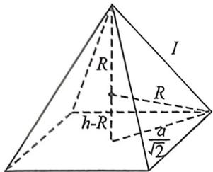
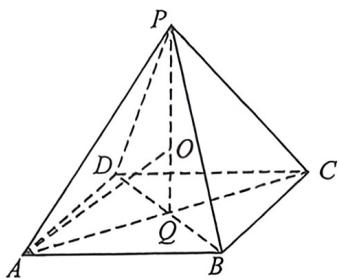

> [!faq]- 例题解析
>
> > [!success]- **【答案】** C
>
> > [!note]- **【解析】**
> > 解析 正一: 设边: 如下左图, 设高为 h, 底边长为 a, 则 $l^{2}=h^{2}+\frac{a^{2}}{2}, R^{2}=(h-R)^{2}+\left(\frac{a}{\sqrt{2}}\right)^{2}$ ,
> >
> > 又 $v_{\text{球}} = \frac{4}{3}\pi R^3 = 36\pi$ ，所以 $R = 3, l^2 = 6h \in [9, 27]$ ，则 $h \in \left[\frac{3}{2}, \frac{9}{2}\right], V = \frac{1}{3}a^2 \cdot h = \frac{1}{3}[18 - 2(h - 3)]^2h = \frac{1}{3}(-2h^3 +$
> >
> > $12h^{2}$ ), $V^{\prime} = -2h(h - 4)$ , 故 $V_{\mathrm{max}} = V|_{A=4} = \frac{64}{3}, V_{\mathrm{min}} = V|_+ = \frac{27}{4}$ , 故选 $C$ .
> >
> > :设角:如下右图,设 $\angle PAO=\theta,\theta\in\left[\frac{\pi}{6},\frac{\pi}{3}\right]$ ,则 $\angle AOQ=2\theta,AQ=3\sin2\theta,OQ=3\cos2\theta$ ,
> >
> > $$
> > V = \frac {1}{3} s h = \frac {1}{3} \times \frac {1}{2} (A C) ^ {2} \times P Q = \frac {1}{3} \times \frac {1}{2} (6 \sin 2 \theta) ^ {2} \times 3 (1 + \cos 2 \theta),
> > $$
> >
> > $t^{\circ}=72\times2\sin^{2}\theta\times\cos^{2}\theta\times\cos^{2}\theta\leqslant72\left(\frac{2\sin^{2}\theta+\cos^{2}\theta+\cos^{2}\theta}{3}\right)^{3}=\frac{64}{3}$ ，当仅当 $\tan\theta=\frac{\sqrt{2}}{2}$ 时，故选C.
> >
> > 
> >
> > 
