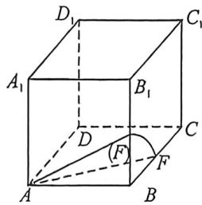
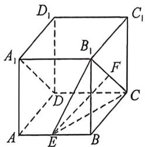
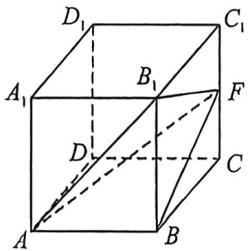
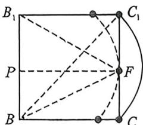

> [!faq]- 例题解析
>
> > [!success]- **【答案】** ACD
>
> > [!note]- **【解析】**
> > 解析 因为点 F 在侧面 $BB_{1}C_{1}C$ 内，所以 $BF \subset$ 平面 $BB_{1}C_{1}C$ 。因为 $AB \perp$ 平面 $BB_{1}C_{1}C, BF \subset$ 平面 $BB_{1}C_{1}C$ ，所以 $AB \perp BF$ 。在 Rt△ABF 中，由 $|AF|^{2} = |AB|^{2} + |BF|^{2}$ 可得 $|BF| = \sqrt{|AF|^{2} - |AB|^{2}} = \sqrt{5 - 4} = 1$ 。所以点 F 的运动轨迹是以 B 为圆心，1 为半径，圆心角为 $\frac{\pi}{2}$ ，所以点 F 的轨迹长度为 $\frac{\pi}{2} \times 1 = \frac{\pi}{2}$ ，故选项 A 正确；
> >
> > 
> >
> > 
> >
> > 
> >
> > 
> >
> > 如图所示, 连接 $B_{1} C, B_{1} E, C E$ . 在 Rt $\triangle BEB_{1}$ 中, $|EB_{1}| = \sqrt{|EB|^{2} + |BB_{1}|^{2}} = \sqrt{5}$ . 同理可得 $|EC| = \sqrt{5}$ , 所以 $\triangle ECB_{1}$ 为等腰三角形. 当点 $F$ 为 $B_{1} C$ 的中点时, 连接 $EF$ , 此时有 $EF \perp B_{1}$
> >
> > C. 在正方体中易知 $B_{1}C \parallel A_{1}D$ ，所以 $EF \perp A_{1}D$ ，此时 $EF$ 与 $A_{1}D$ 所成角为 $\frac{\pi}{2}$ ，故选项 B 错误；
> >
> > 因为 $V_{A_1 - DEC} = V_{A_1 - DEF} = \frac{4}{3}$ , 所以 $CF \parallel$ 平面 $ADE$ , 所以点 $F$ 的轨迹为线段 $B_1C$ , 所以点 $F$ 的轨迹长度为 $2\sqrt{2}$ , 故选项 C 正确;
> >
> > 利用 $2R = \frac{BB_1}{\sin\theta} = \frac{2}{\sin\theta}$ , 即过 $CC_1$ 上任意一点作弧构造正弦等角弧, 设 $\angle BFB_1 = \theta$ , 易知当点 $F$ 为 $CC_1$ 的中点时, $\theta$ 最大. 取 $BB_1$ 的中点 $P$ , 则 $\sin \angle B_1 FP = \sin \frac{\theta}{2} = \frac{|B_1 P|}{|B_1 F|} = \frac{1}{\sqrt{5}}$ , $\cos \angle B_1 FP = \cos \frac{\theta}{2} = \frac{|PF|}{B_1 F} = \frac{2}{\sqrt{5}}$ , 所以 $\sin \theta = 2\sin \frac{\theta}{2}\cos \frac{\theta}{2} = \frac{4}{5}$ ; 当点 $F$ 与点 $C$ 或点 $C_1$ 重合时, $\theta$ 最小, 此时 $\sin \theta = \frac{\sqrt{2}}{2}$ , 所以 $\sin \theta \in \left[\frac{\sqrt{2}}{2}, \frac{4}{5}\right]$ . 因为 $B, B_1, F$ 在球面上, 所以 $\triangle BB_1F$ 的外接圆直径 $2R = \frac{|BB_1|}{\sin\theta} = \frac{2}{\sin\theta} \in \left[\frac{5}{2}, 2\sqrt{2}\right]$ . 所以三棱锥 $A - BB_1F$ 的外接球的直径为 $2r = \sqrt{|AB|^2 + (2R)^2} = \sqrt{4 + 4R^2} \in \left[\frac{\sqrt{41}}{2}, 2\sqrt{3}\right]$ , 所以三棱锥 $A - BB_1F$ 的外接球的半径 $r \in \left[\frac{\sqrt{41}}{4}, \sqrt{3}\right]$ , 所以三棱锥 $A - BB_1F$ 的外接球的表面积为 $4\pi r^2 \in \left[\frac{41\pi}{4}, 12\pi\right]$ , 故选项 D 正确.
> >
> > 故选 **ACD**.
