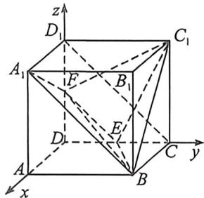
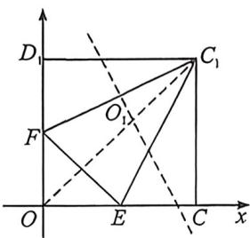
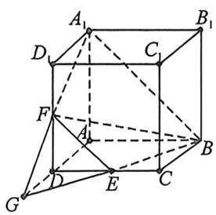
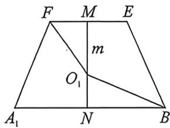

> [!faq]- 例题解析
>
> > [!success]- **【答案】** $11\pi$
>
> > [!note]- **【解析】**
> > 解析 1. 如下图， $EF \parallel CD_1 \parallel BA_1$ ，即 $B, E, F, A_1$ 四点共面，要使四面体 BEFM 的体积最大，只需 $M$ 点离平面 $BEFA_1$ 最远即可，显然点 $D$ 、线段 $CD_1$ 上点到平面 $BEFA_1$ 距离都相等，构建下图空间直角坐标系 $D - xyz$ ，则 $E(0, 1, 0), F(0, 0, 1), B(2, 2, 0)$ ，所以 $\overrightarrow{EF} = (0, -1, 1), \overrightarrow{EB} = (2, 1, 0)$ ，若面 $BEFA_1$ 的一个法向量为 $m = (x, y, z)$ ，则 $\left\{ \begin{array}{l} \overrightarrow{EF} \cdot m = -y + z = 0 \\ \overrightarrow{EB} \cdot m = 2x + y = 0 \end{array} \right.$ ，令 $y = 2$ ，则 $m = (-1, 2, 2)$ ，而 $C(0, 2, 0), C_1(0, 2, 2), A(2, 0, 0), B_1(2, 2, 2)$ ，则 $\overrightarrow{AB} = (0, 2, 0)$ ， $\overrightarrow{EC} = (0, 1, 0), \overrightarrow{EC_1} = (0, 1, 2), \overrightarrow{BB_1} = (0, 0, 2)$ ，
> >
> > 所以 $A$ 到面 $BEFA_{1}$ 距离为 $\frac{|m\cdot\overrightarrow{AB}|}{|m|} = \frac{4}{3}, C$ 到面 $BEFA_{1}$ 距离为 $\frac{|m\cdot\overrightarrow{EC}|}{|m|} = \frac{2}{3}, C_{1}$ 到面 $BEFA_{1}$ 距离为 $\frac{|m\cdot\overrightarrow{EC_{1}}|}{|m|} = 2, B_{1}$ 到面 $BEFA_{1}$ 距离为 $\frac{|m\cdot\overrightarrow{BB_{1}}|}{|m|} = \frac{4}{3}$ , 综上, 正方体的表面上 $C_{1}$ 到面 $BEFA_{1}$ 距离最远, 故四面体 $BEFM$ 的体积最大, $M$ 与 $C_{1}$ 重合,
> >
> > 
> >
> > 
> >
> > 
> >
> > 
> >
> > 首先确定 $\triangle EFC_{1}$ 外接圆圆心 $O_{1}$ 坐标，将 $\triangle EFC_{1}$ 置于如下直角坐标系中，则 $C_{1}(2,2), F(0,1), E(1,0)$ ，则 $O_{1}$ 是直线 $DC_{1}: y = x$ 与 $FC_{1}$ 的垂直平分线 $l$ 的交点，由 $k_{FC_{1}} = \frac{1}{2}$ ，则 $k_{l} = -2$ ，且 $FC_{1}$ 中点为 $\left(1, \frac{3}{2}\right)$ ，故 $l: y - \frac{3}{2} = -2 (x - 1)$ ，即 $l: 4x + 2y - 7 = 0$ ，联立 $\left\{ \begin{array}{l} y = x \\ 4x + 2y - 7 = 0 \end{array} \Rightarrow \left\{ \begin{array}{l} x = \frac{7}{6} \\ y = \frac{7}{6} \end{array} \right.$ ，即 $O_{1}\left(\frac{7}{6}, \frac{7}{6}\right)$ 对应到空间直角坐标系的坐标为 $O_{1}\left(0, \frac{7}{6}, \frac{7}{6}\right)$ ，由四面体 BEFM 的外接球球心 $O$ 在过 $O_{1}$ 垂直于面 $EFC_{1}$ 的直线上，设 $O\left(n, \frac{7}{6}, \frac{7}{6}\right)$ ，由 $|OB| = |OE|$ ，即 $\sqrt{(2 - n)^2 + \left(\frac{5}{6}\right)^2 + \left(\frac{7}{6}\right)^2} = \sqrt{n^2 + \left(\frac{1}{6}\right)^2 + \left(\frac{7}{6}\right)^2}$ ，所以 $n = \frac{7}{6}$ ，
> >
> > 故外接球半径为 $\sqrt{\left(\frac{7}{6}\right)^2 + \left(\frac{1}{6}\right)^2 + \left(\frac{7}{6}\right)^2} = \sqrt{\frac{11}{4}}$ ，故外接球的表面积为 $4\pi \times (\sqrt{\frac{11}{4}})^2 = 11\pi.$
> >
> > $$
> > A D = D G = 2, A _ {1} G = B G = 2 \sqrt {5}, A _ {1} B = 2 \sqrt {2}, h = \sqrt {A G ^ {2} - \left(\frac {A _ {1} B}{2}\right) ^ {2}} = 3
> > $$
> >
> > $\sqrt{2}, S_{GA,B} = \frac{2\sqrt{2} \cdot h}{2} = 6$ ，易知 $C_1$ 到面 BEF 距离最远，四面体 BEFM 的体积最大， $M$ 与 $C_1$ 重合，利用面积射影定理可得 $\cos \alpha = \frac{S_{AA,B}}{S_{GA,B}} = \frac{1}{3}$ ，取 EF 中点 $M, A_1B$ 中点 $N, |MN| = \frac{h}{2} = \frac{3\sqrt{2}}{2}$ ，如图所示，则 $m^2 + \left(\frac{\sqrt{2}}{2}\right)^2 = \left(\frac{3}{2}\sqrt{2} - m\right)^2 + (\sqrt{2})^2$ ，解的 $m = \sqrt{2}$ ，同理 $\left(\frac{3\sqrt{2}}{2} - n\right)^2 - n^2 = \left(\frac{\sqrt{2}}{2}\right)^2, n = \frac{2\sqrt{2}}{3}$ ， $R^2 = \frac{m^2 + n^2 - 2mn\cos \alpha}{\sin^2 \alpha} + \frac{l^2}{4} = \frac{11}{4}$ ，故外接球的表面积为 $4\pi R^2 = 11\pi$ 。故答案为： $11\pi$
