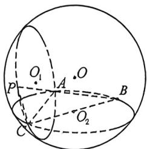
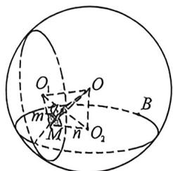

> [!faq]- 例题解析
>
> > [!success]- **【答案】** 详见解析
>
> > [!note]- **【解析】**
> > 解析 (1) 平面四边形 $ABCD$ 中, 作 $BF \parallel AC, DF \perp BF$ , 交 $AC$ 延长线于 $E$ , 由题意知: $DE = \sqrt{3}$ ,
> >
> > 因为 $AB = AC = CD = 2, \angle B = 45^{\circ}$ , 所以 $\angle ACB = \angle B = 45^{\circ}, \angle A = 90^{\circ}$ , 即三角形 $ABC$ 是直角三角形, 因平面 $PAC \perp$ 平面 $BAC$ , 平面 $PAC \cap$ 平面 $BAC = AC, DE \perp AC$ , 所以 $DE \perp$ 平面 $BAC$ ,
> >
> > 故： $V_{P-ABC}=\frac{1}{3}\times\frac{1}{2}\times2\times2\times\sqrt{3}=\frac{2\sqrt{3}}{3}$ ;
> >
> > 
> >
> > 
> > - **①**：法一: 将 $P - AC - B$ 放入外接球, 设其二面角为 $\alpha$ , 设 $\triangle PAC$ 的外接圆圆心为 $O_1$ , $\triangle ABC$ 外接圆的圆心为 $O_2$ , $O_1$ 到交线的距离为 $m$ , $O_2$ 到交线的距离为 $n$ , 交线 $|AC| = l$ , $AC$ 中点为 $M$ , 如中图所示, 则 $OO_1 \perp$ 面 $PAC$ , 且 $OO_2 \perp$ 面 $ACB$ , 所以 $O_1, O_2, M, O_2$ 四点共圆, 利用余弦定理可知 $|O_1O_2|^2 = m^2 + n^2 - 2mn\cos\alpha$ , $OM$ 为此四点共圆的圆的直径, 所以 $|OM|^2 = \frac{|O_1O_2|^2}{\sin^2\alpha}$ , 利用垂径定理可知 $R^2 = |OM|^2 + |AM|^2 = \frac{m^2 + n^2 - 2mn\cos\alpha}{\sin^2\alpha} + \frac{l^2}{4}$ , 由于 $R_1 = \frac{|AC|}{2\sin30^\circ} = 2$ , $m^2 = R_1^2 - \frac{l^2}{4} = \sqrt{3}$ , $R_1 = \frac{|AC|}{2\sin45^\circ} = 2\sqrt{2}$ , $n = \frac{|AB|}{2} = 1$ , 所以 $R^2 = \frac{m^2 + n^2 - 2mn\cos\alpha}{\sin^2\alpha} + \frac{l^2}{4} = \frac{4 - 2\sqrt{3}\cos\alpha}{\sin^2\alpha} + 1 = f(\alpha)$ , 求导得: $f'(\alpha) = \frac{2\sqrt{3}\cos^2\alpha - 8\cos\alpha + 2\sqrt{3}}{\sin^3\alpha} = \frac{(\sqrt{3}\cos\alpha - 1)(\cos\alpha - \sqrt{3})}{\sin^3\alpha}$ , 显然 $\cos\alpha = \frac{\sqrt{3}}{3}$ 时, $f'(\alpha) = 0$ , 由于 $\cos\alpha - \sqrt{3} < 0$ , 故
> >
> >
> > 当 $1 > \cos \alpha > \frac{\sqrt{3}}{3}$ 时， $f'(\alpha) < 0, f(\alpha)$ 单调递减，所以当 $\cos \alpha = \frac{\sqrt{3}}{3}$ 时， $R_{\min}^2 = \frac{4 - 2}{\frac{2}{3}} + 1 = 4, R_{\min} = 2$
> >
> > 法二:由于 $|OA|\geqslant|O_{1}A|$ ，即O与 $O_{1}$ 重合时，三棱锥P-ABC外接球半径 $R=R_{1}=\frac{|AC|}{2\sin30^{\circ}}=2$ 最小，此时PAC所在平面为外接球的大圆面；
> > - **②**：以 $A$ 为原点, $AB, AC$ 分别为 $x$ 轴和 $y$ 轴正方向建立如图所示空间直角坐标系 $A - xyz$ , 则 $A(0,0,0), B(2,0,0)$ , $C(0,2,0)$ 因为 $P(\sqrt{3} \cos \alpha, 3, \sqrt{3} \sin \alpha)$ , 由 ① 可知此时, $P(1,3, \sqrt{2})$ , 因为 $AB = AC = 2$ , 所以 $C(0,2,0), \overrightarrow{AB} = (2,0,0), \overrightarrow{CP} = (1,1, \sqrt{2})$ , 所以 $\cos \overrightarrow{AB}, \overrightarrow{CP} = \frac{\overrightarrow{AB} \cdot \overrightarrow{CP}}{|\overrightarrow{AB}| \cdot |\overrightarrow{CP}|} = \frac{2}{4} = \frac{1}{2}$ , 因为异面直线所成角的范围为 $\left(0, \frac{\pi}{2}\right]$ , 故所求异面直线所成角为 $\frac{\pi}{3}$ .
