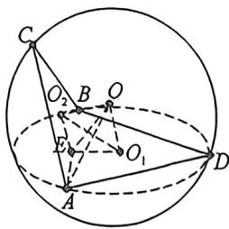
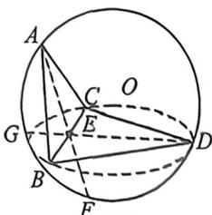
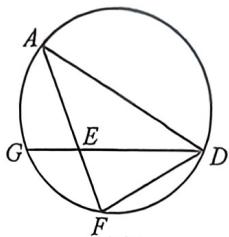

## 考点三_外接内切球综合问题

## 一、棱锥体构造不等式与外接球最值问题

本质就是选择设边还是设角

![[高中/总复习/二轮/2026版高中《MST新思路思维拓展》二轮复习专题/上册/立体几何/考点三_外接内切球综合问题/questions/Q00093028.md]]
![[高中/总复习/二轮/2026版高中《MST新思路思维拓展》二轮复习专题/上册/立体几何/考点三_外接内切球综合问题/questions/Q00093029.md]]
![[高中/总复习/二轮/2026版高中《MST新思路思维拓展》二轮复习专题/上册/立体几何/考点三_外接内切球综合问题/questions/Q00093312.md]]

## 二、棱切球与内切球模型

![[高中/总复习/二轮/2026版高中《MST新思路思维拓展》二轮复习专题/上册/立体几何/考点三_外接内切球综合问题/questions/Q00093031.md]]
![[高中/总复习/二轮/2026版高中《MST新思路思维拓展》二轮复习专题/上册/立体几何/考点三_外接内切球综合问题/questions/Q00093032.md]]
![[高中/总复习/二轮/2026版高中《MST新思路思维拓展》二轮复习专题/上册/立体几何/考点三_外接内切球综合问题/questions/Q00093343.md]]
![[高中/总复习/二轮/2026版高中《MST新思路思维拓展》二轮复习专题/上册/立体几何/考点三_外接内切球综合问题/questions/Q00093344.md]]
![[高中/总复习/二轮/2026版高中《MST新思路思维拓展》二轮复习专题/上册/立体几何/考点三_外接内切球综合问题/questions/Q00093035.md]]

## 四、鳄鱼公式的应用

鳄鱼公式： $R^2 = \frac{m^2 + n^2 - 2mn\cos\alpha}{\sin^2\alpha} +\frac{l^2}{4}$ 以及 $R^2 = \frac{m^2 + n^2 + 2mn\cos\alpha}{\sin^2\alpha} +\frac{l^2}{4}$

如图, 若空间四边形 $ABCD$ 中, 二面角 $C-AB-D$ 的平面角大小为 $\alpha$ , $ABD$ 的外接圆圆心为 $O_{1}$ , $ABC$ 的外接圆圆心为 $O_{2}$ , $E$ 为公共弦 $AB$ 中点, 则 $\angle O_{1}EO_{2}=\alpha$ , $O_{1}E=m$ , $O_{2}E=n$ , $AE=\frac{l}{2}$ , $OA=R$ , 由于 $O、O_{1}$ 、 $E、O_{2}$ 四点共圆, 且 $OE=2R'=\frac{O_{1}O_{2}}{\sin\alpha}$ , 根据余弦定理 $\left|O_{1}O_{2}\right|^{2}=m^{2}+n^{2}-2mn\cos\alpha$ , $R^{2}=|OE|^{2}+|AE|^{2}=\frac{m^{2}+n^{2}-2mn\cos\alpha}{\sin^{2}\alpha}+\frac{l^{2}}{4}$ .

注意 ①此公式最好配合剖面图, 需要求出两个半平面的外接圆半径, 和外接圆圆心到公共弦的距离. ②有的时候需要利用到: $R^{2} = \frac{m^{2} + n^{2} + 2mn\cos\alpha}{\sin^{2}\alpha} + \frac{l^{2}}{4}$ , 和之前的区别就是二面角的两个半平面到底是什么三角形决定, 如果两个是锐角三角形, 如下左图的二面角 $A - BC - D$ , 或者都是钝角三角形, 如下左图的二面角 $F - BC - G$ , 此时的 $\angle O_{1}EO_{2} = \alpha$ , 满足 $|O_{1}O_{2}|^{2} = m^{2} + n^{2} - 2mn\cos\alpha$ .

如果两个半平面一个是锐角,一个是钝角,比如下左图的二面角 $A - BC - G$ ,或者二面角 $D - BC - F$ ,则会出现二面角 $\alpha$ 与 $\angle O_{1}EO_{2}$ 互补,此时 $\left|O_{1}O_{2}\right|^{2} = m^{2} + n^{2} - 2mn\cos (\pi -\alpha) = m^{2} + n^{2} + 2mn\cos \alpha .$

图6

图7

综上,用鳄鱼公式,最好结合剖面图来分析,这样能万无一失,不过判断好两个半平面形状也能快速判断得出结论.

![[高中/总复习/二轮/2026版高中《MST新思路思维拓展》二轮复习专题/上册/立体几何/考点三_外接内切球综合问题/questions/Q00093036.md]]
![[高中/总复习/二轮/2026版高中《MST新思路思维拓展》二轮复习专题/上册/立体几何/考点三_外接内切球综合问题/questions/Q00093037.md]]
![[高中/总复习/二轮/2026版高中《MST新思路思维拓展》二轮复习专题/上册/立体几何/考点三_外接内切球综合问题/questions/Q00093038.md]]
![[高中/总复习/二轮/2026版高中《MST新思路思维拓展》二轮复习专题/上册/立体几何/考点三_外接内切球综合问题/questions/Q00093039.md]]
![[高中/总复习/二轮/2026版高中《MST新思路思维拓展》二轮复习专题/上册/立体几何/考点三_外接内切球综合问题/questions/Q00093040.md]]

## 五、二面角未知的鳄鱼模型外接球最小值

在折叠过程中,二面角 $\alpha$ 未知情况下,若 $m > n$ ,则当且仅当 $\cos \alpha = \frac{n}{m}$ 时,外接球半径取得最小值,本质就是将 $m$ 置于大圆面,利用 $R = |OA| \geqslant |O_1A|$ ,具体证明过程参考例题.

![[高中/总复习/二轮/2026版高中《MST新思路思维拓展》二轮复习专题/上册/立体几何/考点三_外接内切球综合问题/questions/Q00093177.md]]
![[高中/总复习/二轮/2026版高中《MST新思路思维拓展》二轮复习专题/上册/立体几何/考点三_外接内切球综合问题/questions/Q00093043.md]]
