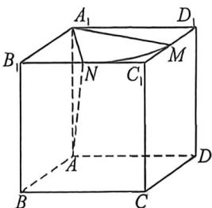

<!-- question-source:start -->
例8 (2026 届河北衡水高三开学考试 T14) 已知正方体 $ABCD-A_{1}B_{1}C_{1}D_{1}$ 的棱长为 $a$ , 以 $A$ 为球心, $\frac{\sqrt{21}}{3}$ $a$ 为半径的球面与该正方体不含顶点 $A$ 的三个面的交线总长度为 $\frac{\sqrt{3}}{3}\pi$ , 则 $a=$ \_\_\_\_.

<!-- question-source:end -->

![[高中/总复习/二轮/2026版高中《MST新思路思维拓展》二轮复习专题/上册/立体几何/考点二_立体几何隐藏的轨迹与最值问题/questions/answers/Q00093018A1.md]]
