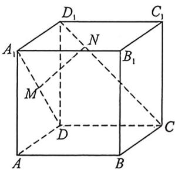
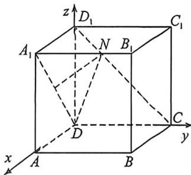

<!-- question-source:start -->
例11 (2024·涉县月考)如图,在棱长为1的正方体 $ABCD-A_{1}B_{1}C_{1}D_{1}$ 中, $\overrightarrow{DM}=\lambda\overrightarrow{DA}_{1}(0<\lambda<1)$ , $\overrightarrow{CN}=\mu\overrightarrow{CD_{1}}(0<\mu<1)$ , 若 $MN//$ 平面 $AA_{1}C_{1}C$ , 则线段 $MN$ 的长度的最小值为 ( )

A. $\frac{1}{3}$ B. $\frac{1}{2}$ C. $\frac{\sqrt{2}}{3}$ D. $\frac{\sqrt{3}}{3}$
<!-- question-source:end -->

![[高中/总复习/二轮/2026版高中《MST新思路思维拓展》二轮复习专题/上册/立体几何/考点二_立体几何隐藏的轨迹与最值问题/questions/answers/Q00093175A1.md]]
