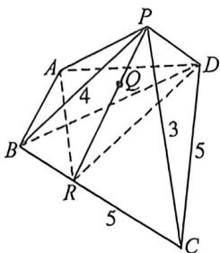

<!-- question-source:start -->
例15 (2025·武汉二调)四棱锥 $P - ABCD$ 中, $AB = AD = \sqrt{10}, CB = CD = 5, \angle BAD = 90^{\circ}, PB = 4, PC = 3, \triangle PBC$ 内部点 $Q$ 满足四棱锥 $Q - ABCD$ 与三棱锥 $Q - PAD$ 的体积相等, 则 $PQ$ 长的最小值为 \_\_\_\_.

<!-- question-source:end -->

![[高中/总复习/二轮/2026版高中《MST新思路思维拓展》二轮复习专题/上册/立体几何/考点二_立体几何隐藏的轨迹与最值问题/questions/answers/Q00093176A1.md]]
