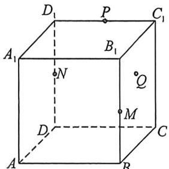
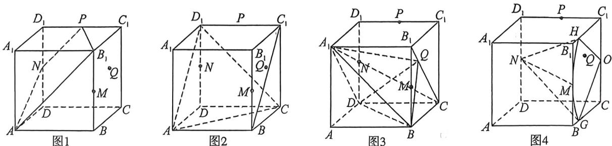

<!-- question-source:start -->
例5 (2025·多选·贵州黔南期末)如图,在棱长为2的正方体 $ABCD-A_{1}B_{1}C_{1}D_{1}$ 中, $M,N,P$ 分别是 $BB_{1},DD_{1},C_{1}D_{1}$ 的中点, $Q$ 是侧面 $BCC_{1}B_{1}$ 内的动点(含边界),则下列结论正确的是()

A. $A, B_{1}, P, N$ 四点共面

B. 异面直线 $CD_{1}$ 与 $BC_{1}$ 所成的角为 $\frac{\pi}{4}$

C. 当点 $Q$ 在线段 $B_{1} C$ 上运动时, 三棱锥 $A_{1} - B D Q$ 的体积为定值

D. 当 $NQ=2\sqrt{2}$ 时，点 Q 的运动轨迹的长度为 $\frac{2\pi}{3}$

<!-- question-source:end -->

![[高中/总复习/二轮/2026版高中《MST新思路思维拓展》二轮复习专题/上册/立体几何/考点二_立体几何隐藏的轨迹与最值问题/questions/answers/Q00093251A1.md]]
