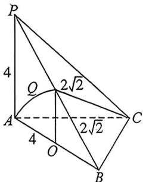

<!-- question-source:start -->
例6 (2025·山东威海三模)在三棱锥 $P - ABC$ 中, $PA \perp$ 平面 $ABC$ , $PA = AB = 4$ , $\angle ACB = 90^{\circ}$ . 若 $Q$ 为侧面 $PAB$ 内的动点, $CQ = 2\sqrt{2}$ , 当该三棱锥的体积最大时, $Q$ 的轨迹与 $AB$ , $PB$ 所围成区域的面积为 \_\_\_\_.

<!-- question-source:end -->

![[高中/总复习/二轮/2026版高中《MST新思路思维拓展》二轮复习专题/上册/立体几何/考点二_立体几何隐藏的轨迹与最值问题/questions/answers/Q00093308A1.md]]
