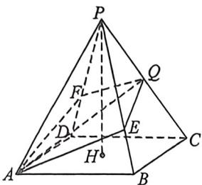
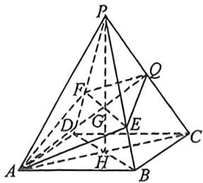

<!-- question-source:start -->
例14 (2025·湘豫名校入学摸底,T18)如图,正四棱锥 P-ABCD 中,Q 是棱 PC 的中点,H 是底面 ABCD 的中心. 过 AQ 作平面与棱 PB,PD 分别交于不同的点 E,F(可以是端点).

(1)求证: AQ, PH, EF 三线交于一点;

(2)若 $AB = 2, PA = \sqrt{11}$ . (i)求直线 $AQ$ 与平面 $PAB$ 所成角的正弦值; (ii)求多面体 $AEQFP$ 的体积的取值范围.
<!-- question-source:end -->

![[高中/总复习/二轮/2026版高中《MST新思路思维拓展》二轮复习专题/上册/立体几何/考点二_立体几何隐藏的轨迹与最值问题/questions/answers/Q00093311A1.md]]
