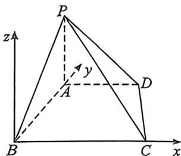
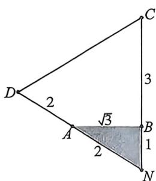
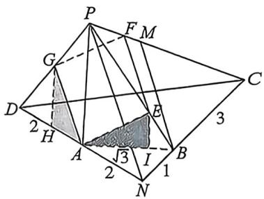

> [!faq]- 例题解析
>
> > [!success]- **【答案】** $\frac{2\sqrt{15}}{5}$
>
> > [!note]- **【解析】**
> > 解析 法一(强哥建系硬解)过 B 作 AP 的平行线为 z 轴, BC, BA 分别为 x, y 轴, 如图建系, 令 PA = t,
> >
> > 则 $B(0,0,0),A(0,\sqrt{3},0),P(0,\sqrt{3},t),C(3,0,0),D(1,2\sqrt{3},0),E,F;G$ 分别在 $PB,PC,$ $PD$ 上，令 $\overrightarrow{BE} = \lambda \overrightarrow{BP},\overrightarrow{CF} = \mu \overrightarrow{CP},\overrightarrow{DG} = m\overrightarrow{DP}$ ，所以 $E(0,\sqrt{3}\lambda ,t\lambda),F(3 - 3\mu ,\sqrt{3}\mu ,t\mu),G(1$
> >
> > 
> >
> > $-m, 2\sqrt{3} - \sqrt{3} m, mt), \overrightarrow{AE} = (0, \sqrt{3} \lambda - \sqrt{3}, t \lambda), \overrightarrow{GF} = (2 - 3 \mu + m, \sqrt{3} \mu - 2\sqrt{3} + \sqrt{3} m, t (\mu - m)), \overrightarrow{AE} = \overrightarrow{GF}$ , 所以 $\left\{\begin{aligned}&0=2-3\mu+m\\&\sqrt{3}\lambda-\sqrt{3}=\sqrt{3}\mu-2\sqrt{3}+\sqrt{3}m,\text{所以}\\&\lambda=\mu-m\end{aligned}\right.$ $\left\{\begin{aligned}&\mu=\frac{5}{6}\\ &m=\frac{1}{2},\overrightarrow{AE}=\left(0,-\frac{2\sqrt{3}}{3},\frac{1}{3}t\right),\overrightarrow{EF}=\left(\frac{1}{2},\frac{\sqrt{3}}{2},\frac{t}{2}\right),|\overrightarrow{AE}|=|\overrightarrow{EF}|,\\&\lambda=\frac{1}{3}\end{aligned}\right.$
> >
> > 所以 $\frac{4}{3} +\frac{1}{9} t^2 = 1 + \frac{t^2}{4}$ ，所以 $t = \frac{2\sqrt{15}}{5}$ 即 $PA = \frac{2\sqrt{15}}{5}.$
> >
> > 
> >
> > 
> >
> > 法二(线性截面构造):如左图,水平面ABCD中,延长DA与CB交于点N,易求得AN=2,BN=1,如右图,作GH⊥AD于H,EI⊥AB于I,作BM∥PN交PC于M,令PA=t,由于A为DN中点,所以AG∥PN且AG= $\frac{1}{2}$ PN,所以|GH|= $\frac{1}{2}$ t,|AH|=1;所以 $AG^{2}=\frac{t^{2}}{4}+1,\frac{BC}{CN}=\frac{CM}{CP}=\frac{BM}{PN}=\frac{3}{4}$ ,四边形AEFG为菱形,则EF∥PN∥BM,且EF= $\frac{1}{2}$ PN,即 $\frac{EF}{BM}=\frac{PE}{PB}=\frac{2}{3}$ ,所以EI= $\frac{t}{3},AI=\frac{2}{\sqrt{3}}$ ,所以 $AE^{2}=\frac{4}{3}+\frac{t^{2}}{9}$ ,所以 $\frac{4}{3}+\frac{t^{2}}{9}=\frac{t^{2}}{4}+1$ ,所以 $t=\frac{2\sqrt{15}}{5}$ ,故答案为: $\frac{2\sqrt{15}}{5}$
