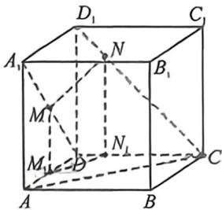

> [!faq]- 例题解析
>
> > [!success]- **【答案】** D
>
> > [!note]- **【解析】**
> > 解析 一: 如图, 以点 $D$ 为坐标原点, 分别以 $DA, DC, DD_{1}$ 所在直线为 $x, y, z$ 轴, 建立空间直角坐标系, 则有 $D(0,0,0), A_{1}(1,0,1), C(0,1,0), D_{1}(0,0,1), B(1,1,0)$ , 依题意, $\overrightarrow{DM} = \lambda \overrightarrow{DA}_{1} = \lambda (1,0,1) = (\lambda,0,\lambda), \overrightarrow{DN} = \overrightarrow{DC} + \overrightarrow{CN} = \overrightarrow{DC} + \mu \overrightarrow{CD}_{1} = (0,1,0) + \mu (0,-1,1) = (0,1-\mu,\mu)$ , 于是 $\overrightarrow{MN} = \overrightarrow{DN} - \overrightarrow{DM} = (-\lambda,1-\mu,\mu-\lambda)$ , 又因 $DB \perp AC, CC_{1} \perp$ 平面 $ABCD, DB \subset$ 平面 $ABCD$ , 则 $CC_{1} \perp BD$ , 又 $CC_{1} \cap AC = C, CC_{1}, AC \subset$ 平面 $ACC_{1}A_{1}$ , 故 $BD \perp$ 平面 $ACC_{1}A_{1}$ , 故平面 $AA_{1}C_{1}C$ 的法向量可取为 $n = \overrightarrow{DB} = (1,1,0)$ , 因 $MN //$ 平面 $AA_{1}C_{1}C$ , 故 $\overrightarrow{MN} \cdot n = -\lambda + 1 - \mu = 0$ , 即 $\lambda + \mu = 1$ , 则
> >
> >
> > $\overrightarrow{MN}|^{2} = \lambda^{2} + (1 - \mu)^{2} + (\mu - \lambda)^{2} = 2\lambda^{2} + (1 - 2\lambda)^{2} = 6\lambda^{2} - 4\lambda + 1 = 6\left(\lambda - \frac{1}{3}\right)^{2} + \frac{1}{3}$ , 当 $\bar{\lambda} = \frac{1}{3}$ 时, $|\overrightarrow{MN}|_{\text{max}} = \frac{\sqrt{3}}{3}$ .
> >
> > 法二(对角线向量定理): 由于 $BD \perp$ 面 $AA_{1}C_{1}C$ , 且 $MN \parallel$ 平面 $AA_{1}C_{1}C$ , 故 $BD \perp MN$ , 根据对角线向量定理, 所以 $\overrightarrow{BD}\cdot \overrightarrow{MN} = |BN|^2 + |DM|^2 - |BM|^2 - |DN|^2 = 0, |BN|^2 = |BC|^2 + |CN|^2 = 1 + 2\mu^2, |DM|^2 = 2\lambda^2, \overrightarrow{BM} = \lambda \overrightarrow{BA_1}$
> >
> > $+ (1-\lambda) \overrightarrow{BD}$ , 所以 $|BM|^2 = 2\lambda^2 - 2\lambda + 2, \overrightarrow{DN} = \mu \overrightarrow{DD_1} + (1-\mu) \overrightarrow{DC}, |DN|^2 = 2\mu^2 - 2\mu + 1$ , 所以 $\lambda + \mu = 1$ , 或者如图构造面面平行, 作 $MM_1 \perp AD$ 于 $M_1, NN_1 \perp CD$ 于 $N_1$ , 易知 $M_1 N_1 // AC$ , 所以 $\mu = \frac{CN_1}{CD} = \frac{AM_1}{AD} = 1 - \frac{DM_1}{AD} = 1 - \lambda$ , 所以 $\lambda + \mu = 1$ , 由于异面直线 $CN$ 与 $DM$ 所成角为 $60^\circ$ , 所以
> >
> > 
> >
> > $$
> > \cos 6 0 ^ {\circ} = \frac {| C M | ^ {2} + | D N | ^ {2} - | C D | ^ {2} - | M N | ^ {2}}{2 | C N | \cdot | D M |} = \frac {1 + 2 \lambda^ {2} + 2 \mu^ {2} - 2 \mu + 1 - 1 - | M N | ^ {2}}{4 \lambda \mu} = \frac {1}{2},
> > $$
> >
> > $|MN|^{2}=6\mu^{2}-8\mu+3$ ，当 $\mu=\frac{2}{3}$ 时， $|\overrightarrow{MN}|_{\min}=\frac{\sqrt{3}}{3}$ .
> >
> > 故选 **D**.
