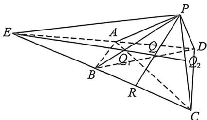
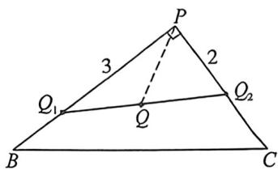
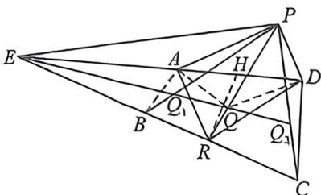

> [!faq]- 例题解析
>
> > [!success]- **【答案】** $\frac{6\sqrt{13}}{13}$
>
> > [!note]- **【解析】**
> > 解析 $\angle A B = A D = \sqrt { 1 0 } , \angle B A D = 9 0 ^ { \circ }$ ，得 $BD = 2 \sqrt { 5 }$ ，又 $CB = CD = 5$ ，所以 $AC = 3 \sqrt { 5 }$ （两个等腰三角形高的和），则 $S_{\triangle BCD} = \frac{1}{2} BD \cdot \sqrt{BC^2 - \left(\frac{1}{2} BD\right)^2} = \frac{1}{2} \times 2 \sqrt {5} \times 2 \sqrt {5} = 10, S_{\triangle ABD} = \frac{1}{2} \sqrt {10} \times \sqrt {10} = 5$ ，由 $PB = 4, PC = 3$ ，得 $PB^2 +PC^2 = BC^2$ ，则 $PB \perp PC, \cos \angle CBD = \frac{\sqrt{5}}{5}, \sin \angle CBD = \frac{2 \sqrt{5}}{5}$ ，且 $S_{ABCD} = \frac{1}{2} \times 2 \sqrt{5} \times 3 \sqrt{5} = 15, SACD = \frac{1}{2} S_{ABCD} = \frac{15}{2},$
> >
> >
> > 则 $S_{ABD} = \frac{2}{3} S_{ACD}$
> >
> > 法一(强哥硬解): 在四棱锥 P-ABCD 中, 延长 PQ 交 BC 于点 R, 令 $\overrightarrow{BR} = \lambda \overrightarrow{BC}, \overrightarrow{PQ} = \mu \overrightarrow{PR}$ ,
> >
> > $$
> > \sin \angle A B R = \sin \left(\angle C B D + \frac {\pi}{4}\right) = \frac {\sqrt {2}}{2} \left(\frac {2 \sqrt {5}}{5} + \frac {\sqrt {5}}{5}\right) = \frac {3 \sqrt {1 0}}{1 0}, S _ {\triangle A B R} = \frac {1}{2} \times \sqrt {1 0} \times 5 \lambda \times \frac {3 \sqrt {1 0}}{1 0} = \frac {1 5 \lambda}{2}, S _ {\triangle C D R} = 1 0 (1 - \lambda),
> > $$
> >
> > 设点 $P$ 到底面距离为 $h$ ，依题意 $V_{Q - ABCD} = V_{Q - PAD} = \mu V_{R - PAD} = \mu V_{P - ARD}$ ，由 $V_{Q - ABCD} = (1 - \mu)V_{P - ABCD}$
> >
> > 得 $(1 - \mu) \cdot \frac{1}{3} \cdot 15h = \mu \cdot \frac{1}{3}\left[15 - \frac{15\lambda}{2} - 10(1 - \lambda)\right] \cdot h$ ，则 $3(1 - \mu) = \mu\left(1 + \frac{\lambda}{2}\right), \mu = \frac{6}{\lambda + 8}$ ，
> >
> > 而 $\overrightarrow{PR} = (1 - \lambda)\overrightarrow{PB} +\lambda \overrightarrow{PC}$ ，则 $\overrightarrow{PR}^2 = 16(1 - \lambda)^2 +9\lambda^2,PQ^2 = \mu^2 PR^2 = 36\cdot \frac{25\lambda^2 - 32\lambda + 16}{(\lambda + 8)^2}$ ，令 $\lambda +8 = t\in (8,9),$
> >
> > $$
> > P Q ^ {2} = 3 6 \cdot \frac {2 5 (t - 8) ^ {2} - 3 2 (t - 8) + 1 6}{t ^ {2}} = 3 6 \cdot \frac {2 5 t ^ {2} - 4 3 2 t + 1 8 7 2}{t ^ {2}} = 3 6 [ 1 4 4 (\frac {1 3}{t ^ {2}} - \frac {3}{t}) + 2 5 ],
> > $$
> >
> > 当 $\frac{1}{t} = \frac{3}{26}$ 即 $t = \frac{26}{3},\lambda = \frac{2}{3}$ 时， $(PQ^{2})_{\min} = \frac{36}{13}$ 所以 $PQ$ 长的最小值为 $\frac{6\sqrt{13}}{13}$
> >
> > 
> >
> > 
> >
> > 法二(动态定直线构造)如左图, 延长 $AD$ 与 $BC$ 交于 $E$ , 由于 $S_{ABD} = \frac{2}{3} S_{ACD}$ , 故 $B$ 为 $CE$ 一个三等分点, $\frac{BC}{CE} = \frac{1}{3}$ , $|AE| = \sqrt{|EB|^2 - |AB|^2} = 3\sqrt{10}$ , $S_{ECD} = 4S_{ACD} = 2S_{ABCD}$ , 利用等体积法, 构造满足条件 $PB$ 边上的点 $Q_1$ , $PC$ 边上的点 $Q_2$ , 连接 $Q_1Q_2$ , 由于 $V_{Q_1 - PAD} = V_{Q_1 - ABCD} = \frac{1}{2} V_{Q_1 - ECD} = 3V_{Q_1 - ABD}$ , 所以 $|PQ_1| = 3|Q_1B| = 3$ , $V_{Q_1 - PAD} = V_{Q_1 - ABCD} = \frac{1}{2} V_{Q_1 - ECD} = 2V_{Q_1 - ACD}$ , 所以 $|PQ_2| = 2|Q_2C| = 2$ , 由于 $\frac{S_{PAD}}{S_{PED}} = \frac{1}{4}, \frac{S_{ABCD}}{S_{ECD}} = \frac{1}{2}$ , 所以 $V_{Q - PAD} = V_{Q - ABCD} \Leftrightarrow \frac{1}{2} V_{Q - ECD} = \frac{1}{4} V_{Q - PED}$ , 又因为 $\frac{S_{PED}}{S_{CED}} =$ 定值 (定值由 $P$ 点决定), 所以 $Q$ 在一条到面 $PED$ 与面 $CED$ 距离比为定值的一条定直线上 (类比于三角形的底边上一定点到两边距离比为定值, 则三棱锥的底面上一条定直线到两侧面的距离比为定值), 即
> >
> > $Q_{1}Q_{2}$ ，并且 $Q_{1}Q_{2}$ 过点 $E$ ，所以 $\left|PQ\right|_{\min} = d_{P - Q_1Q_3} = \frac{2\times 3}{\sqrt{13}} = \frac{6\sqrt{13}}{13}$ （如右图）.
> >
> > 法三(梅氏定理): 令 $\frac{ER}{EC} = \lambda$ , 作 $RH \perp AD$ 于 $H$ , 则 $\frac{RH}{AB} = \frac{ER}{EB} = \frac{3\lambda}{2}$ , 所以 $\frac{S_{ARD}}{S_{ECD}} = \frac{1}{4}$ · $\frac{\frac{3}{2}\lambda|AB|}{\frac{3}{2}|AB|} = \frac{\lambda}{4}, V_{Q-PAD} = V_{Q-ABCD} = \frac{1}{2}V_{Q-ECD} = \frac{2}{\lambda}V_{Q-ARD}$ , 所以 $\frac{PQ}{QR} = \frac{2}{\lambda}$ , 由法二
> >
> > 
> >
> > 易知 $|PQ_1| = 3|Q_1B| = 3, |PQ_2| = 2|Q_2C| = 2$ ，利用梅氏定理逆定理，当 $\frac{PQ_1}{Q_1B} \cdot \frac{BE}{ER} \cdot \frac{RQ}{QP} = 1 \Leftrightarrow 3 \cdot \frac{\frac{2}{3}}{\lambda} \frac{RQ}{QP} = 1 \Leftrightarrow \frac{QP}{RQ}$
> >
> > $= \frac{2}{\lambda}$ ，则 $E, Q_{1}, Q$ 三点共线，
> >
> > 当 $\frac{PQ_2}{\gamma C} \cdot \frac{CE}{ER} \cdot \frac{RQ}{QP} = 1 \Leftrightarrow 2 \cdot \frac{1}{\lambda} \frac{RQ}{QP} = 1 \Leftrightarrow \frac{QP}{RQ} = \frac{2}{\lambda}$ , 则 $E, Q_2, Q$ 三点共线, $Q$ 一定在 $Q_1 Q_2$ 线上,
> >
> > $|PC|_{\min}=d_{P-Q,Q}=\frac{2\times3}{\sqrt{13}}=\frac{6\sqrt{13}}{13}$ ，故答案为： $\frac{6\sqrt{13}}{13}$ .
