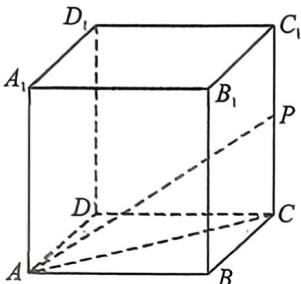
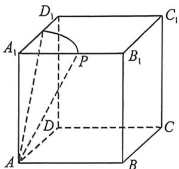
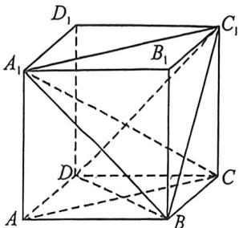

> [!faq]- 例题解析
>
> > [!success]- **【答案】** BCD
>
> > [!note]- **【解析】**
> > 解析 在三棱锥 $P-ABC$ 中, 因为 $PA \perp$ 平面 $ABC$ , 所以当该三棱锥的体积最大时, 底面 $\triangle ABC$ 的面积必须最大, 由于 $\triangle ABC$ 为直角三角形, 且 $AB=4$ , 所以 $C$ 的轨迹是以 $AB$ 的中点 $O$ 为圆心, $AB$ 的长为直径的圆, 故当 $CO \perp AB$ , $\triangle ABC$ 的面积最大, 此时 $\triangle ABC$ 为等腰直角三角形, 所以 $CO=2$ , $CA=CB=2\sqrt{2}$ , 所以三棱锥的体积最大值为 $V=\frac{1}{3} \times 4 \times 4 = \frac{16}{3}$ . 又因为 $PA \perp$ 平面 $ABC$ , $CO \subset$ 平面 $ABC$ , 所以 $PA \perp CO$ , 又因为 $CO \perp AB$ , $PA \cap AB=A$ , 所以 $CO \perp$ 平面 $PAB$ . 因为 $Q$ 为侧面 $PAB$ 内的动点, $OQ \subset$ 平面 $PAB$ , 所以 $CO \perp OQ$ , 因为 $CQ=2\sqrt{2}$ , 所以 $OQ=\sqrt{CQ^2-CO^2}=2$ , 所以点 $Q$ 在以 $O$ 为圆心, $AB$ 为直径的圆上, 所以 $Q$ 的轨迹与 $AB$ , $PB$ 所围成区域为以 $O$ 为圆心, $2$ 为半径的 $\frac{1}{4}$ 个圆和一个以 $OB$ 为直角边的等腰直角三角形, 所以所围成区域的面积为 $\frac{1}{4} \times \pi \times 2^2 + \frac{1}{2} \times 2 \times 2 = \pi + 2$ . 故答案为: $\pi+2$ 例 (2025·多选·辽宁大连期末)已知正方体 $ABCD-A_1B_1C_1D_1$ , $AB=a$ , 且直线 $AP$ 与直线 $CC_1$ 夹角为 $\varphi$ , 则下列说法正确的是 ( )
> >
> > A. 若点 P 在棱 $CC_{1}$ 上，且 $\tan\varphi=2\sqrt{2}$ ，则 $PC_{1}=a$
> >
> >
> > <!-- source-part:4 pages:151-200 -->
> >
> > B. 若 $\varphi = \frac{\pi}{6}$ , 且点 $P$ 在面 $A; B_1 C_1 D_1$ 上, 则点 $P$ 的轨迹长度为 $\frac{\sqrt{3} a\pi}{6}$
> >
> > C. $P$ 是 $ABCD - A_{1}B_{1}C_{1}D_{1}$ 面上的动点， $DP \perp A_{1}C$ ，则 $P$ 的轨迹图形面积是 $\frac{\sqrt{3}}{2} a^{2}$
> >
> > D. 点 $P$ 为截面 ${A}_{1}{C}_{1}B$ 上的动点, ${DP}\bot  {A}_{1}C$ ,则点 $P$ 的轨迹长度是 $\sqrt{2}a$
> >
> > 解析 对于 A, 如图, 点 P 在 $CC_{1}$ 上, 则 $\varphi = \angle APC$ , 所以 $\tan\varphi = \frac{AC}{PC} = \frac{\sqrt{2}a}{PC} = 2\sqrt{2}$ , 解得 $PC = \frac{1}{2}a$ , 所以 $PC_{1} = \frac{1}{2}a$ , 故 A 错误;
> >
> > 
> >
> > 
> >
> > 
> >
> > 对于 B, 因为 $CC_{1} \parallel AA_{1}$ ，所以直线 AP 与 $AA_{1}$ 夹角为 $\varphi = \frac{\pi}{6}$ ，所以射线 AP 的轨迹是以 $AA_{1}$ 为轴，轴截面等腰三角形顶角为 $\frac{\pi}{3}$ 的圆锥侧面，当点 P 在底面 $A_{1}B_{1}C_{1}D_{1}$ 内时， $A_{1}P = \frac{\sqrt{3}}{3}a$ ，点 P 的轨迹是以 $A_{1}$ 为圆心，所含圆心角为 $\frac{\pi}{2}$ 的圆弧，轨迹长度为 $\frac{\pi}{2} \times \frac{\sqrt{3}a}{3} = \frac{\sqrt{3}\pi a}{6}$ ，故 B 正确；
> >
> > 对于 C, 如图, 连接 AC, BD, $BC_{1}$ , $DC_{1}$ , 由 $A_{1}A \perp$ 平面 ABCD, BD ⊂ 平面 ABCD, 则 $BD \perp A_{1}A$ , 又 $BD \perp AC$ ,
> >
> > $A_{1}A\cap AC=A,A_{1}A,AC\subset$ 平面 $A_{1}AC$ ，故 $BD\perp$ 平面 $A_{1}AC,A_{1}C\subset$ 平面 $A_{1}AC$ ，所以 $A_{1}C\perp BD$ ，同理，可得 $A_{1}C\perp BC_{1}$ ，而 $BD\cap BC_{1}=B,BD,BC_{1}\subset$ 平面 $BDC_{1}$ ，所以 $A_{1}C\perp$ 平面 $BDC_{1}$ ，因为 $A_{1}C\perp DP$ ，所以 $DP\subset$ 平面 $BDC_{1}$ ，又P是正方体 $ABCD-A_{1}B_{1}C_{1}D_{1}$ 面上的动点，所以点P的轨迹图形是 $\triangle BDC_{1}$ ，易知 $\triangle BDC_{1}$ 是正三角形，边长为 $\sqrt{2}a$ ，所以点P的轨迹图形的面积为 $\frac{\sqrt{3}}{4}\times(\sqrt{2}a)^{2}=\frac{\sqrt{3}a^{2}}{2}$ ，故C正确；
> >
> > 对于 D, 由 C 可知, $DP \subset$ 平面 $BDC_{1}$ , 又点 P 为截面 $A_{1}C_{1}B$ 上的动点, 平面 $A_{1}C_{1}B \cap$ 平面 $BDC_{1} = C_{1}B$ , 所以点 P 的轨迹是线段 $BC_{1}$ , 长度为 $\sqrt{2}a$ , 故 D 正确.
> >
> > 故选 **BCD**.
