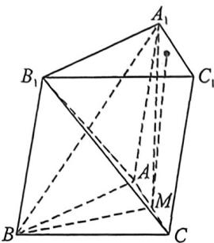
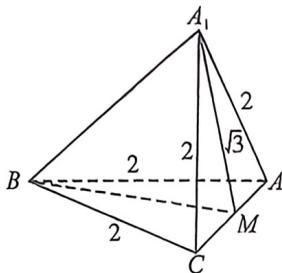

> [!faq]- 例题解析
>
> > [!success]- **【答案】** C
>
> > [!note]- **【解析】**
> > 解析 1. 非出示意图如左下: 设线段 $AC$ 中点为 $M$ , 则易知四边形 $ABB_{1}A_{1}$ 是菱形, 所以 $A_{1}B \perp AB_{1}$
> >
> > 
> >
> > 
> >
> > 因为 $A_{1}B \perp B_{1}C, A_{1}B \perp AB_{1}$ , 且 $B_{1}C \cap AB_{1} = B_{1}$ , 所以 $A_{1}B \perp$ 平面 $AB_{1}C$ , 所以 $A_{1}B \perp AC$ , 因为 $BM$ 是等边 $\triangle ABC$ 中 $AC$ 边上的中线, 所以 $BM \perp AC$ , 又且 $A_{1}B$ 与 $BM$ 相交于点 $B$ , 所以 $AC \perp$ 平面 $A_{1}BM$ , 所以 $AC \perp A_{1}M$ , 所以 $A_{1}M = \sqrt{AA_{1}^{2} - AM^{2}} = \sqrt{3}$ . 因为平面 $ABC //$ 平面 $A_{1}B_{1}C_{1}$ , 又 $AB \subset$ 平面 $ABC, A_{1}C_{1} \subset$ 平面 $A_{1}B_{1}C_{1}$ , 所以异面直线 $AB$ 与 $A_{1}C_{1}$ 的距离, 即平面 $ABC$ 与平面 $A_{1}B_{1}C_{1}$ 的距离, 设该距离为 $d$ . 过 $M$ 作 $MM_{1} \perp$ 平面 $A_{1}B_{1}C_{1}$ , 垂足为 $M_{1}$ , 故 $d = |MM_{1}| \leqslant |MA_{1}| = \sqrt{3}$ ,
> >
> > 法二(对角线向量定理): 由 $A_{1}B \perp B_{1}C$ 得 $\overrightarrow{A_{1}B} \cdot \overrightarrow{B_{1}C} = \frac{A_{1}C^{2} + BB_{1}^{2} - A_{1}B_{1}^{2} - BC^{2}}{2} = 0$ , 所以 $A_{1}C = 2$ , 如右上图所示, 构造的两个等边三角形半平面 $ABC$ 与 $AA_{1}C$ , 且 $\left. \begin{array}{l} AC \perp BM \\ AC \perp A_{1}M \end{array} \right\} \Rightarrow AC \perp$ 面 $A_{1}BM$ , 异面直线 $AB$ 与 $A_{1}C_{1}$ 的距离, 即平面 $ABC$ 与平面 $A_{1}B_{1}C_{1}$ 的距离, 即为 $\triangle A_{1}BM$ 底边 $BM$ 上的高, 显然当 $A_{1}M \perp BM$ 时, 高最大, 所以异面直线 $AB$ 与 $A_{1}C_{1}$ 的距离最大值为 $\sqrt{3}$ .
> >
> > 故选 **C**.
