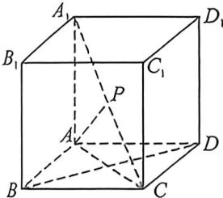
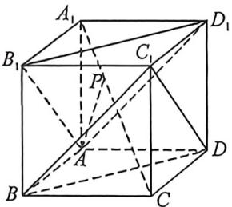
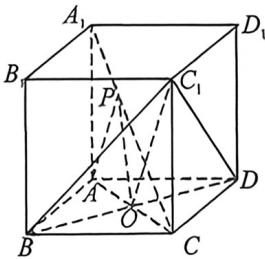
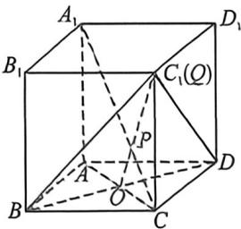

> [!faq]- 例题解析
>
> > [!success]- **【答案】** BC
>
> > [!note]- **【解析】**
> > 解析 对于 A, 因为四边形 ABCD 为正方形, 所以 $AC \perp BD$ , 又 $A_{1}A \perp$ 平面 ABCD, $BD \subset$ 平面 ABCD, 所以 $A_{2}A \perp BD$ , 又 $AC \cap A_{1}A = A$ , $AC, A_{1}A \subset$ 平面 $ACA_{1}$ , 所以 $BD \perp$ 平面 $ACA_{1}$ , P 为 $A_{1}C$ 中点, $AP \subset$ 平面 $ACA_{1}$ , 所以 $AP \perp BD$ , 所以 A 错误;
> >
> > 
> >
> > 
> >
> > 
> >
> > 
> >
> > 对于 B, 因为 $BB_{1}=DD_{1}$ , $BB_{1}\parallel DD_{1}$ ，所以四边形 $BB_{1}D_{1}D$ 为平行四边形，所以 $D_{1}B_{1}\parallel DB$ ，又 $D_{1}B_{1}\not\subset$ 平面 $BC_{1}D$ ， $DB\subset$ 平面 $BC_{1}D$ ，所以 $D_{1}B_{1}\parallel$ 平面 $BC_{1}D$ ，同理可得 $AB_{1}\parallel DC_{1}$ ，又 $AB_{1}\not\subset$ 平面 $BC_{1}D$ ， $DC_{1}\subset$ 平面 $BC_{1}D$ ，所以 $AB_{1}\parallel$ 平面 $BC_{1}D$ ，又 $D_{1}B_{1}\cap AB_{1}=B_{1}$ ， $D_{1}B_{1}$ ， $AB_{1}\subset$ 平面 $AB_{1}D_{1}$ ，所以平面 $AB_{1}D_{1}\parallel$ 平面 $BC_{1}D$ 。
> >
> > 若 $AP \parallel$ 平面 $BC_{1}D$ , 则点 $P$ 为 $A_{1}C$ 与平面 $AB_{1}D_{1}$ 的交点, 由于平面 $AB_{1}D_{1}$ 与平面 $BC_{1}D$ 将 $A_{2}C$ 三等分, 故 $\lambda = \frac{1}{3}$ , B 正确;
> >
> > 对于 C, 若 O 在底面 ABCD 上, 则 O 为正方形 ABCD 的中心, 又 OP = OA = OC = OB = $\sqrt{2}$ , 其中 $\cos\angle ACA_{1}=\frac{AC}{A_{1}C}=$
> >
> >
> > $\frac{2\sqrt{2}}{2\sqrt{3}} = \frac{\sqrt{6}}{3}$ , 在 $\triangle CPO$ 中, $\cos \angle OCP = \frac{CO^2 + CP^2 - OP^2}{2CO \cdot CP}$ , 即 $\frac{2 + CP^2 - 2}{2\sqrt{2} \cdot CP} = \frac{\sqrt{6}}{3}$ , 解得 $CP = \frac{4\sqrt{3}}{3}$ , 故 $A_1P = \frac{2\sqrt{3}}{3}$ , 故 $A_1P:PC = 1:2$ , 则 $\lambda = \frac{1}{3}$ , 根据 $B$ 可知, 此时 $AP //$ 平面 $BC_1D$ , 又易知 $A, P, C_1, O$ 共面, $C_1O$ 为平面 $APC_1O$ 与平面 $BC_1D$ 的交线, 故 $AP // C_1O, C$ 正确; 对于 $D$ , 由 $A$ 知, $BD \perp$ 平面 $ACA_1$ , 又 $CA_1 \subset$ 平面 $ACA_1$ , 所以 $BD \perp CA_1$ , 同理可证 $BC_1 \perp CA_1$ , 又 $BD \cap BC_1 = B, BD, BC_1 \subset$ 平面 $BDC_1$ , 所以 $A_1C \perp$ 平面 $BDC_1, A_1C \perp$ 平面 $BDP$ 时, 点 $P$ 为 $A_1C$ 与平面 $BDC_1$ 的交点, $CC_1$ 与平面 $BDP$ 交点 $Q$ , 故点 $Q, C_1$ 重合, 故 $CQ = 2, D$ 错误.
> >
> > 故选 **BC**.
