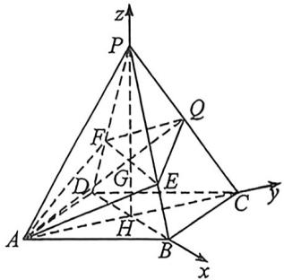
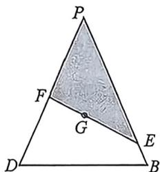
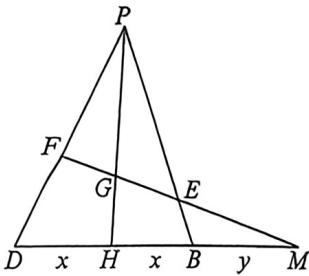

> [!faq]- 例题解析
>
> > [!success]- **【答案】** 详见解析
>
> > [!note]- **【解析】**
> > 解析 (1)根据题意, $A, Q$ 为定点, $E, F$ 为动点. 如图, 连接 $EF, BD, AC$ . 在平面 $AEQF$ 中, 不妨设 $EF$ 交 $AQ$ 于点 $G$ , 因为 $EF \subset$ 平面 $PBD$ , 所以 $G \in$ 平面 $PBD$ . 因为 $AQ \subset$ 平面 $PAC$ , 所以 $G \in$ 平面 $PAC$ . 因为平面 $PBD \cap$ 平面 $PAC = PH$ , 所以点 $G$ 也在 $PH$ 上, 即 $AQ, PH, EF$ 三线交于一点.
> >
> > (2)(i)因为 $AB = 2, PA = \sqrt{11}$ , 所以 $AH = \sqrt{2}, PH = \sqrt{PA^2 - AH^2} = \sqrt{11 - 2} = 3$ . 由已知四边形ABCD为正方形, 易得 $AC \perp BD$ . 以 $H$ 为坐标原点, 分别以 $HB, HC, HP$ 所在的直线为 $x$ 轴, $y$ 轴, $z$ 轴, 建立如图所示的空间直角坐标系, 则 $A(0, -\sqrt{2}, 0), B(\sqrt{2}, 0, 0), P(0, 0, 3), Q\left(0, \frac{\sqrt{2}}{2}, \frac{3}{2}\right)$ .
> >
> > 
> >
> > 
> >
> > 所以 $\overrightarrow{AQ} = \left(0, \frac{3\sqrt{2}}{2}, \frac{3}{2}\right), \overrightarrow{AB} = (\sqrt{2}, \sqrt{2}, 0), \overrightarrow{AP} = (0, \sqrt{2}, 3)$ . 设平面 $PAB$ 的法向量为 $n = (x, y, z)$ ,
> >
> > 则 $n \perp \overrightarrow{AB}, n \perp \overrightarrow{AP}$ , 即 $\left\{ \begin{array}{l} \sqrt{2}x + \sqrt{2}y = 0 \\ \sqrt{2}y + 3z = 0 \end{array} \right.$ . 取 $x = -1$ , 得 $y = 1, z = -\frac{\sqrt{2}}{3}$ , 即平面 $PAB$ 的一个法向量为 $n = \left(-1, 1, -\frac{\sqrt{2}}{3}\right)$ . 所以 $|\cos \overrightarrow{AQ}, n| = \frac{|\overrightarrow{AQ} \cdot n|}{|\overrightarrow{AQ}| |n|} = \frac{\left|\frac{3\sqrt{2}}{2} + \frac{3}{2} \times \left(-\frac{\sqrt{2}}{3}\right)\right|}{\sqrt{\left(\frac{3\sqrt{2}}{2}\right)^2 + \left(\frac{3}{2}\right)^2} \times \sqrt{1 + 1 + \left(\frac{\sqrt{2}}{3}\right)^2}} = \frac{\sqrt{30}}{15}$ . 所以直线 $AQ$ 与平面 $PAB$ 所成角的正弦值为 $\frac{\sqrt{30}}{15}$ .
> >
> > (Ⅱ)由(1)知 AQ, PH, EF 三线交于点 G, 显然 G 是 $\triangle PAC$ 和 $\triangle PDB$ 的重心.
> >
> >
> > 同时 $V_{P-A\infty F}=V_{P-A\infty F}+V_{P-Q\infty F}=V_{A-P\infty F}+V_{Q-P\infty F}=\frac{1}{3}\times\frac{3}{2}AH\times S_{\triangle PEF}=\frac{\sqrt{2}}{2}S_{\triangle PEF}$ . 因此, 只需要求 $\triangle PEF$ 的面积的取值范围. 如图, $\triangle PDB$ 中, $PD=PB=\sqrt{11}, DB=2\sqrt{2}$ , 由重心的性质知 $\overrightarrow{PG}=\frac{1}{3}\overrightarrow{PD}+\frac{1}{3}\overrightarrow{PB}$ ①, 又 F, G, E 三点共线, 所以 $\overrightarrow{PG}=m\overrightarrow{PF}+(1-m)\overrightarrow{PE}$ , 且 $\overrightarrow{PF}=\lambda\overrightarrow{PD}, \overrightarrow{PE}=\mu\overrightarrow{PB}(0<\lambda\leqslant1,0<\mu\leqslant1)$ , 所以 $\overrightarrow{PG}=m\lambda\overrightarrow{PD}+(1-m)\mu\overrightarrow{PB}$ ②. 对比①②两式, 可得 $\frac{1}{\lambda}+\frac{1}{\mu}=3$ . 因为 $\begin{cases}0<\lambda\leqslant1\\0<\mu=\frac{\lambda}{3\lambda-1}\leqslant1\end{cases}$ , 所以 $\frac{1}{2}\leqslant\lambda\leqslant1$ . 因为 $S_{\triangle PEF}=\frac{1}{2}\left|\overrightarrow{PE}\right|\left|\overrightarrow{PF}\right|\sin\angle EPF$ , $S_{\triangle PBD}=\frac{1}{2}\left|\overrightarrow{PB}\right|\left|\overrightarrow{PD}\right|\sin\angle BPD=\frac{1}{2}\left|BD\right|\left|PH\right|=3\sqrt{2}$ , 所以 $S_{\triangle PEF}=\lambda\mu\cdot S_{\triangle PBD}=3\sqrt{2}\lambda\mu$ . 又 $\lambda\mu=\lambda\cdot\frac{\lambda}{3\lambda-1}=$
> >
> > $\frac{\lambda^2}{3\lambda - 1}$ , 令 $t = 3\lambda - 1, t \in \left[\frac{1}{2}, 2\right]$ , 则 $\lambda = \frac{t + 1}{3}$ , 故 $\lambda \mu = f(t) = \frac{\left(\frac{t + 1}{3}\right)^2}{t} = \frac{1}{9} \times \frac{t^2 + 2t + 1}{t} = \frac{1}{9} \left(t + \frac{1}{t} + 2\right) \in \left[\frac{4}{9}, \frac{1}{2}\right]$ . 因此 $S_{\triangle PEF} = \lambda \mu \cdot S_{\triangle PBD} = 3\sqrt{2}\lambda \mu \in \left[\frac{4\sqrt{2}}{3}, \frac{3\sqrt{2}}{2}\right]$ . 所以 $V_{P - AEQP} = \frac{\sqrt{2}}{2} S_{\triangle PEF} \in \left[\frac{4}{3}, \frac{3}{2}\right]$ , 即多面体 $AEQFP$ 的体积的取值范围为 $\left[\frac{4}{3}, \frac{3}{2}\right]$ .
> >
> > 
> >
> > 注意 关于 $\frac{1}{\lambda}+\frac{1}{\mu}=3$ ，我们利用梅氏定理来解读，延长EF交DB延长线于M，F、G、M三点共线，则 $\frac{PF}{FD}\cdot\frac{DM}{MH}\cdot\frac{HG}{GP}=1$ ，即 $\frac{\lambda}{1-\lambda}\cdot\frac{2x+y}{x+y}\cdot\frac{1}{2}=1①$ ，同理，E、G、M三点共线，则 $\frac{PE}{EB}\cdot\frac{BM}{MH}\cdot\frac{HG}{GP}=1$ ，即 $\frac{\mu}{1-\mu}\cdot\frac{y}{x+y}\cdot\frac{1}{2}=1②$ ，所以 $\frac{2x+y}{2(x+y)}+\frac{y}{2(x+y)}=\frac{1-\lambda}{\lambda}+\frac{1-\mu}{\mu}\Leftrightarrow\frac{1}{\lambda}+\frac{1}{\mu}=3.$
