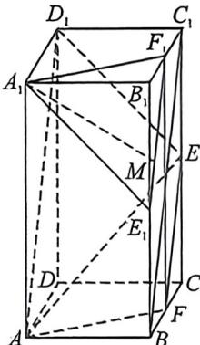

> [!faq]- 例题解析
>
> > [!success]- **【答案】** C
>
> > [!note]- **【解析】**
> > $CC_{1}$ 的中点, 点 M 为侧面 $BCC_{1}B_{1}$ 内一动点, 且 $A_{1}M \parallel$ 平面 $AED_{1}$ , 则线段 $A_{1}M$ 的长度的最小值为 ( )
> > A. 1
> > B. $\frac{6}{5}$ C. $\frac{3\sqrt{3}}{5}$ D. $\frac{\sqrt{30}}{5}$
> >
> > 
> >
> > 解析 在正四棱柱 $ABCD - A_{1}B_{1}C_{1}D_{1}$ 中，取 $BC$ 中点 $F$ ，连接 $BC_{1}, EF$ ，由四边形 $ABC_{1}D_{1}$ 是矩形， $E$ 为棱 $CC_{1}$ 的中点，得 $AD_{1} // BC_{1} // EF$ ，平面 $AED_{1}$ 即平面 $AD_{1}EF$ ，取 $BB_{1}, B_{1}C_{1}$ 中点 $E_{1}, F_{1}$ ，连接 $A_{1}E_{1}, A_{1}F_{1}, E_{1}F_{1}, FF_{1}$ ，则 $E_{1}F_{1} // BC_{1} // EF, EF \subset$ 平面 $AED_{1}, E_{1}F_{1} \not\subset$ 平面 $AED_{1}$ ，则 $E_{1}F_{1} //$ 平面 $AED_{1}$ ，而 $FF_{1} // BB_{1} // AA_{1}, FF_{1} = BB_{1} = AA_{1}$ ，于是四边形 $AFF_{1}A_{1}$ 是平行四边形， $A_{1}F_{1} // AF$ ，又 $AF \subset$ 平面 $AED_{1}, A_{1}F_{1} \not\subset$ 平面 $AED_{1}$ ，则 $A_{1}F_{1} //$ 平面 $AED_{1}$ ，而 $A_{1}F_{1} \cap E_{1}F_{1} = F_{1}, A_{1}F_{1}, E_{1}F_{1} \subset$ 平面 $A_{1}E_{1}F_{1}$ ，因此平面 $A_{1}E_{1}F_{1} //$ 平面 $AED_{1}$ ，而 $A_{1}M //$ 平面 $AED_{1}$ ，则 $A_{1}M \subset$ 平面 $A_{1}E_{1}F_{1}$ ，即 $M \in$ 平面 $A_{1}E_{1}F_{1}$ ，又点 $M$ 为侧面 $BCC_{1}B_{1}$ 内一动点，则点 $M$ 的轨迹为线段 $E_{1}F_{1}$ ，由 $AA_{1} = 2AB = 2$ ，得 $A_{1}F_{1} = E_{1}F_{1} = \frac{\sqrt{5}}{2}, A_{1}E_{1} = \sqrt{2}, \cos \angle A_{1}E_{1}F_{1} = \frac{\frac{1}{2}A_{1}E_{1}}{E_{1}F_{1}} = \frac{\sqrt{2}}{\sqrt{5}}, \sin \angle A_{1}E_{1}F_{1} = \sqrt{1 - \left(\frac{\sqrt{2}}{\sqrt{5}}\right)^{2}} = \frac{\sqrt{3}}{\sqrt{5}}$ ，因此等腰 $\triangle A_1E_1F_1$ 的腰 $E_1F_1$ 上的高等于 $A_1E_1\sin \angle A_1E_1F_1 = \frac{\sqrt{6}}{\sqrt{5}} = \frac{\sqrt{30}}{5}$ ，
> >
> > $$
> > A _ {1} M
> > $$
> >
> > $$
> > \frac {\sqrt {3 0}}{5}
> > $$
