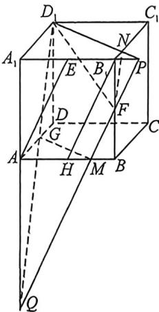

## 考点二_立体几何隐藏的轨迹与最值问题

## 一、定长的圆弧隐藏

![[高中/总复习/二轮/2026版高中《MST新思路思维拓展》二轮复习专题/上册/立体几何/考点二_立体几何隐藏的轨迹与最值问题/questions/Q00093251.md]]
![[高中/总复习/二轮/2026版高中《MST新思路思维拓展》二轮复习专题/上册/立体几何/考点二_立体几何隐藏的轨迹与最值问题/questions/Q00093308.md]]
![[高中/总复习/二轮/2026版高中《MST新思路思维拓展》二轮复习专题/上册/立体几何/考点二_立体几何隐藏的轨迹与最值问题/questions/Q00093018.md]]

## 二、由线面平行和垂直构造的隐藏线性最值问题

![[高中/总复习/二轮/2026版高中《MST新思路思维拓展》二轮复习专题/上册/立体几何/考点二_立体几何隐藏的轨迹与最值问题/questions/Q00093342.md]]
![[高中/总复习/二轮/2026版高中《MST新思路思维拓展》二轮复习专题/上册/立体几何/考点二_立体几何隐藏的轨迹与最值问题/questions/Q00093309.md]]
![[高中/总复习/二轮/2026版高中《MST新思路思维拓展》二轮复习专题/上册/立体几何/考点二_立体几何隐藏的轨迹与最值问题/questions/Q00093175.md]]
![[高中/总复习/二轮/2026版高中《MST新思路思维拓展》二轮复习专题/上册/立体几何/考点二_立体几何隐藏的轨迹与最值问题/questions/Q00093310.md]]

## 三、截面线性构造最值问题

例B (2026届广东高三上学期9月质量检测 T11·多选)在棱长为2的正方体 $ABCD-A_{1}B_{1}C_{1}D_{1}$ 中, $\overrightarrow{A_{1}E}=\overrightarrow{EB_{1}},\overrightarrow{BF}=\overrightarrow{FB_{1}}$ , 过 $D_{1}F$ 且平行于 $AE$ 的平面记为 $\alpha$ . 下列说法正确的是 ( )
A. 若棱 $AB$ 与 $\alpha$ 交于点 $M$ , 则 $\overrightarrow{AM}=\frac{3}{4}\overrightarrow{AB}$ B. 若棱 $B_{1}C_{1}$ 与 $\alpha$ 交于点 $N$ , 则 $\overrightarrow{B_{1}N}=\frac{1}{4}\overrightarrow{B_{1}C_{1}}$ C. $\alpha$ 截正方体所得截面是五边形
D. $\alpha$ 截正方体所得截面的面积为 $\frac{9}{4}\sqrt{5}$

解析 垂正方体 $ABCD - A_{1}B_{1}C_{1}D_{1}$ 中，取 $AB$ 的中点 $H$ ，因 $E$ 为 $A_{1}B_{1}$ 中点，则 $B_{1}E \parallel AH, B_{1}E = AH = 1$ ，四边形 $AHB_{1}E$ 为平行四边形，则 $B_{1}H \parallel AE$ ，过点 $F$ 作直线 $FM \parallel B_{1}H$ 交 $AB$ 于 $M$ ，分别交 $A_{1}B_{1}, A_{1}A$ 的延长线于 $P, Q$ ，连接 $D_{1}P$ 交 $B_{1}C_{1}$ 于 $N$ ，连接 $D_{1}Q$ 交 $AD$ 于 $G$ ，连接 $MG, NF$ ，显然 $PQ \parallel AE$ ，而 $PQ \subset$ 平面 $PD_{1}Q, AE \subset$ 平面 $PD_{1}Q$ ，故 $AE \parallel$ 平面 $PD_{1}Q$ ，又 $D_{1}F \subset$ 平面 $PD_{1}Q$ ，则平面 $PD_{1}Q$ 是过 $D_{1}F$ 且平行于 $AE$ 的平面，平面 $PD_{1}Q$ 即为平面 $\alpha$ ，对于 C，平面 $\alpha$ 截正方体所得截面是五边形 $D_{1}NFMG$ ，故 C 正确；

对于 A, 在 $\triangle BB_{1}H$ 中, $FM \parallel B_{1}H$ , F 是 $BB_{1}$ 中点, 则 M 是 BH 中点, 故 $BM = \frac{1}{2}BH = \frac{1}{4}AB$ , $\overrightarrow{AM} = \frac{3}{4}\overrightarrow{AB}$ , 故 A 正确;

对于 B, 由 $B_{1}P \parallel BM$ , F 是 $BB_{1}$ 中点, 得 $B_{1}P = BM = \frac{1}{2}$ , 而 $B_{1}N \parallel A_{1}D_{1}$ , 则 $\frac{B_{1}N}{A_{1}D_{1}} = \frac{B_{1}P}{A_{1}P} = \frac{\frac{1}{2}}{2 + \frac{1}{2}} = \frac{1}{5}$ , 即 $B_{1}N = \frac{1}{5}A_{1}D_{1} = \frac{1}{5}B_{1}C_{1}$ , 故 B 错误;

对于 D, 由 $AQ \parallel BF$ , 得 $\frac{AQ}{BF} = \frac{AM}{BM} = 3$ , 则 AQ = 3, $A_{1}Q = 5$ , $D_{1}Q = \sqrt{2^{2} + 5^{2}} = \sqrt{29}$ , 而 $A_{1}P =$

$\frac{5}{2}$ , 则 $D_{1}P = \sqrt{2^{2} + \left(\frac{5}{2}\right)^{2}} = \frac{\sqrt{41}}{2}, PQ = \sqrt{A_{1}Q^{2} + A_{1}P^{2}} = \sqrt{5^{2} + \left(\frac{5}{2}\right)^{2}} = \frac{5\sqrt{5}}{2}$ , 在 $\triangle PD_{1}Q$ 中, 由余弦定理, $\cos \angle PD_{1}Q = \frac{29 + \frac{41}{4} - \frac{125}{4}}{2 \times \sqrt{29} \times \frac{\sqrt{41}}{2}} = \frac{8}{\sqrt{29} \times \sqrt{41}}$ , 则 $\sin \angle PD_{1}Q = \sqrt{1 - \left(\frac{8}{\sqrt{29} \cdot \sqrt{41}}\right)^{2}} = \frac{15\sqrt{5}}{\sqrt{29} \times \sqrt{41}}$ , 于是, $S_{\triangle PD_{1}Q} = \frac{1}{2} D_{1}P \cdot D_{1}Q\sin \angle PD_{1}Q = \frac{1}{2} \times \frac{\sqrt{41}}{2} \times \sqrt{29} \times \frac{15\sqrt{5}}{\sqrt{29} \times \sqrt{41}} = \frac{15\sqrt{5}}{4}$ . 由平面 $\alpha \cap$ 平面 $ABCD = MG$ , 平面 $\alpha \cap$ 平面 $A_{1}B_{1}C_{1}D_{1} = D_{1}P$ , 平面 $ABCD //$ 平面 $A_{1}B_{1}C_{1}D_{1}$ , 得 $MG // D_{1}P$ , 同理 $NF // D_{1}Q$ , 又 $\frac{QG}{QD_{1}} = \frac{AQ}{A_{1}Q} = \frac{3}{5}, \frac{NF}{D_{1}Q} = \frac{NP}{D_{1}P} =$ $\frac{B_1N}{A_1D_1} = \frac{1}{5}$ ，因△QGM相似于△QPD1，△PNF相似于△PD1Q，则 $S_{\triangle QMG} = \frac{9}{25} S_{\triangle PD,Q + }S_{\triangle PNF} = \frac{1}{25} S_{\triangle PD,Q + }$

则 $S_{D,NFMG} = \left(1 - \frac{9}{25} -\frac{1}{25}\right)S_{\triangle RD,Q} = \frac{3}{5}\times \frac{15\sqrt{5}}{4} = \frac{9\sqrt{5}}{4},$ 故D正确.故选：ACD.

![[高中/总复习/二轮/2026版高中《MST新思路思维拓展》二轮复习专题/上册/立体几何/考点二_立体几何隐藏的轨迹与最值问题/questions/Q00093311.md]]
![[高中/总复习/二轮/2026版高中《MST新思路思维拓展》二轮复习专题/上册/立体几何/考点二_立体几何隐藏的轨迹与最值问题/questions/Q00093176.md]]
![[高中/总复习/二轮/2026版高中《MST新思路思维拓展》二轮复习专题/上册/立体几何/考点二_立体几何隐藏的轨迹与最值问题/questions/Q00093027.md]]
