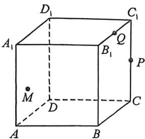
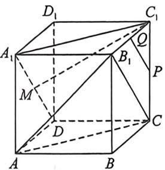
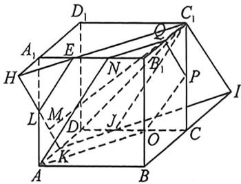

<!-- question-source:start -->
例38 (2025·多选·黑龙江哈尔滨期中)如图,正方体 $ABCD-A_{1}B_{1}C_{1}D_{1}$ 棱长为 1 ,点 $M$ 是侧面 $ADD_{1}A_{1}$ 上的一个动点(含边界), $P,Q$ 分别为棱 $CC_{1},B_{1}C_{1}$ 的中点,过点 $A,P,Q$ 的平面记为 $\alpha$ ,则

A. 若 M 在线段 $A_{1}D$ 上，则 $C_{1}M \parallel$ 平面 $AB_{1}C$

B. 若 $C_{1}M \parallel \alpha$ ，则点 $M$ 的运动路径的长度为 $\frac{\sqrt{2}}{2}$

C. 存在点 $M$ , 使得 $AC_{1} \perp$ 平面 $PQM$

D. $\alpha$ 分正方体两部分的体积为 $V_{1}, V_{2} (V_{1} < V_{2})$ , 则 $V_{1} = \frac{25}{72}$ 解析 A, 由正方体得, $A_{1}C_{1} \parallel AC$ , $A_{1}D \parallel B_{1}C$ , 因为 $A_{1}C_{1} \not\subset$ 平面 $AB_{1}C$ , $AC \subset$ 平面 $AB_{1}C$ , 所以 $A_{1}C_{1} \parallel$ 平面 $AB_{1}C$ , 同理可得 $A_{1}D \parallel$ 平面 $AB_{1}C$ , 又 $A_{1}C_{1} \cap A_{1}D = A_{1}$ , $A_{1}C_{1}$ , $A_{1}D \subset$ 平面 $A_{1}C_{1}D$ , 所以平面 $A_{1}C_{1}D \parallel$ 平面 $AB_{1}C$ , 又 $C_{1}M \subset$ 平面 $A_{1}C_{1}D$ , 所以 $C_{1}M \parallel$ 平面 $AB_{1}C$ , 故 A 正确;

<!-- question-source:end -->

![[高中/总复习/二轮/2026版高中《MST新思路思维拓展》二轮复习专题/上册/立体几何/考点五_体积分割与比例问题/questions/answers/Q00093258A1.md]]
