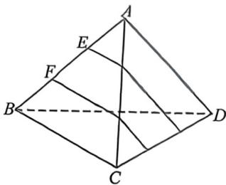
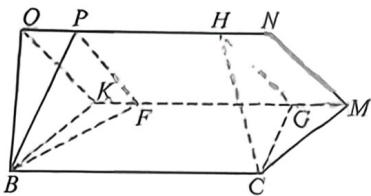

<!-- question-source:start -->
例36 (2025·浙江宁波模拟预测)如图, $E, F$ 是正四面体ABCD棱 $A B$ 上的两个三等分点,分别过 $E, F$ 作同时平行于 $A D, B C$ 的平面,将正四面体分成上中下三部分,其体积分别记为 $V_{\text {上}}, V_{\text {中}}, V_{\text {下}}$ , 则 $V_{\text {上}}: V_{\text {中}}: V_{\text {下}} =$

<!-- question-source:end -->

![[高中/总复习/二轮/2026版高中《MST新思路思维拓展》二轮复习专题/上册/立体几何/考点五_体积分割与比例问题/questions/answers/Q00093314A1.md]]
