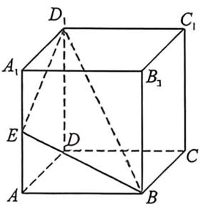
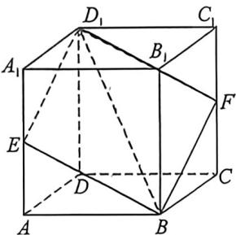

<!-- question-source:start -->
例37 (2025·北京期末)正方体 $ABCD - A_{1}B_{1}C_{1}D_{1}$ 的棱长为 1, E 是棱 $AA_{1}$ 上的一个动点, 平面 $BED_{1}$ 与棱 $CC_{1}$ 交于点 F.

(1)给出下列三个结论:①四棱锥 $B_{1}-BED_{1}F$ 的体积为定值;②四边形 $BED_{1}F$ 可能是正方形;③若在棱 $DC$ 上存在点 $P$ , 使得 $AP \parallel$ 平面 $BED_{1}$ , 则线段 $A_{1}E \in \left[0, \frac{1}{2}\right]$ ; 其中所有正确结论的序号是 \_\_\_\_.

(2)当点 E 不是棱 $AA_{1}$ 的端点时, 设 $D_{1}E \cap DA = M, D_{1}F \cap DC = N$ , 记 $\triangle D_{1}MN$ 和四边形 $BED_{1}F$ 的面积分别为 $S_{1}, S_{2}$ , 则 $\frac{S_{1}}{S_{2}}$ 的取值范围是 \_\_\_\_.

<!-- question-source:end -->

![[高中/总复习/二轮/2026版高中《MST新思路思维拓展》二轮复习专题/上册/立体几何/考点五_体积分割与比例问题/questions/answers/Q00093315A1.md]]
