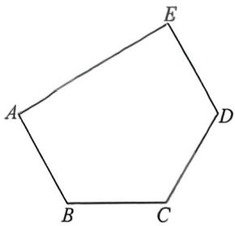
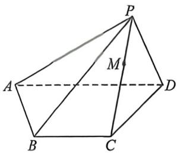
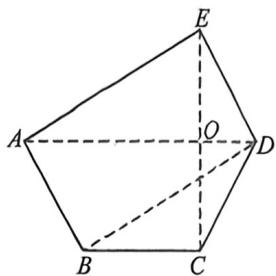

<!-- question-source:start -->
例39 (2026 届广东深圳外国语高三第二次月考 T19) 如图 1, 在平面五边形 ABCDE 中, AB = BC = CD = DE = 1, AE = $\sqrt{3}$ , AE ⊥ DE, AB // DE, 将三角形 ADE 沿着 AD 向上翻折至三角形 ADP, 得到四棱锥 P - ABCD, 如图 2 所示.

图1

图2

(1) 求证: $AD \perp PC;$

(2)若平面 $PAD \perp$ 平面ABCD,

(i)求平面 PAB 与平面 PCD 所成角的余弦值；

(Ⅱ)点 M 在线段 PC 上, 设平面 ADM 将四棱锥 P-ABCD 分为两个多面体, 其中点 P 所在的多面体体积为 $V_{1}$ , 另一个多面体体积为 $V_{2}$ , 若 $V_{1}: V_{2} = 8:17$ , 求点 M 到平面 ABCD 的距离.
<!-- question-source:end -->

![[高中/总复习/二轮/2026版高中《MST新思路思维拓展》二轮复习专题/上册/立体几何/考点五_体积分割与比例问题/questions/answers/Q00093316A1.md]]
