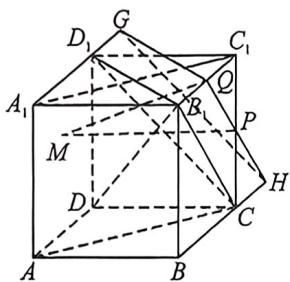
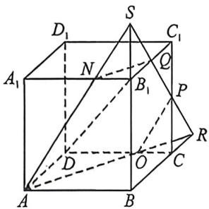

> [!faq]- 例题解析
>
> > [!success]- **【答案】** ABD
>
> > [!note]- **【解析】**
> > 对于 B, 作出 $\alpha$ 截正方体所得的截面 AOPQN, 如图所示, 则 $B_{1}N = \frac{1}{3}$ , 过点 $C_{1}$ 作平面 $C_{1}HKI // \alpha$ , 截得正方体的截面为 $LKJC_{1}E$ , 如图所示, 因为 $C_{1}M \subset$ 平面 $C_{1}HKI$ , 所以 $C_{1}M // \alpha$ , 此时 $EN = B_{1}N = A_{1}E = \frac{1}{3}, A_{1}H = \frac{1}{2}$ , 进而 $A_{1}L = AL = AK = \frac{1}{2}$ , 所以 $LK = \sqrt{AL^{2} + AK^{2}} = \frac{\sqrt{2}}{2}$ , 当 $M$ 在 $KL$ 上运动时, 满足 $C_{1}M // \alpha$ , 故 B 正确;
> >
> > 对于 C，连接 $B_{1}C, B_{1}D_{1}, CD_{1}, A_{1}C_{1}, AC$ ，由正方体得， $B_{1}D_{1} \perp A_{1}C_{1}, B_{1}D_{1} \perp AA_{1}$ ，又 $A_{1}C_{1} \cap AA_{1} = A_{1}, A_{1}C_{1}, AA_{1} \subset$ 平面 $A_{1}ACC_{1}$ ，所以 $B_{1}D_{1} \perp$ 平面 $A_{1}ACC_{1}$ ，又 $AC_{1} \subset$ 平面 $A_{1}ACC_{1}$ ，所以 $B_{1}D_{1} \perp AC_{1}$ ，同理得， $B_{1}C \perp AC_{1}$ ，又 $B_{1}D_{1} \cap B_{1}C = B_{1}, B_{1}D_{1}, B_{1}C \subset$ 平面 $B_{1}CD_{1}$ ，所以 $AC_{1} \perp$ 平面 $B_{1}CD_{1}$ ，当过 PQ 的平面 $\perp AC_{1}$ 时，该平面平行于平面 $B_{1}CD_{1}$ ，过 PQ 作平面 $GQH \parallel$ 平面 $B_{1}CD_{1}$ ，交 $A_{1}D_{1}, BC$ 延长线于点 G, H，如图所示，由图可知，平面 GQH 与正方形 $ADD_{1}A_{1}$ 无交点，故不存在点 M，使得 $AC_{1} \perp$ 平面 PQM，故 C 错误；
> >
> > 
> >
> > 
> >
> > 对于 D, 作出平面 $\alpha$ 截得正方体的截面 AOPQN, 则 $B_{1}N=OC=\frac{1}{3}$ , $SB_{1}=B_{1}Q=PC=CR=\frac{1}{2}$ ,
> >
> > 所以 $V_{S-ABR}=\frac{1}{3}S_{ABR}\times SB=\frac{1}{3}\times\frac{1}{2}\times1\times\frac{3}{2}\times\frac{3}{2}=\frac{3}{8},V_{S-NB,Q}=\frac{1}{3}S_{NB,Q}\times SB_{1}=\frac{1}{3}\times\frac{1}{2}\times\frac{1}{2}\times\frac{1}{3}\times\frac{1}{2}=\frac{1}{72},$ $V_{R-ACP}=\frac{1}{3}S_{ACP}\times CR=\frac{1}{3}\times\frac{1}{2}\times\frac{1}{3}\times\frac{1}{2}\times\frac{1}{2}=\frac{1}{72},$ 所以 $V_{1}=\frac{3}{8}-\frac{1}{72}-\frac{1}{72}=\frac{25}{72}$ ，故 D 正确；
> >
> > 故选 **ABD**.
