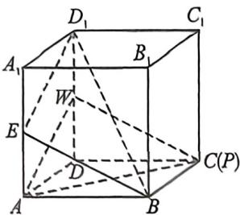
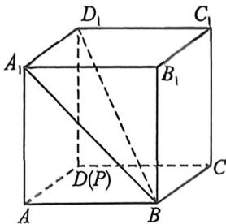
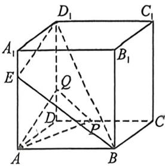
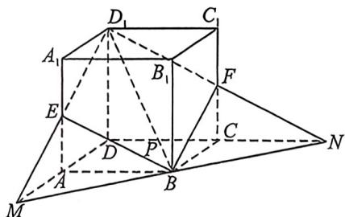

> [!faq]- 例题解析
>
> > [!success]- **【答案】** ①③， $[2, +\infty)$
>
> > [!note]- **【解析】**
> > 解析 (1)①因为平面 $ADD_{1}A_{1} //$ 平面 $BCC_{1}B_{1}$ , 平面 $BED_{1} \cap$ 平面 $ADD_{1}A_{1} = ED_{1}$ , 平面 $BED_{1} \cap$ 平面 $BCC_{1}B_{1} = BF$ , 所以 $ED_{1} // BF$ , 同理可得 $EB // D_{1}F$ , 故四边形 $ED_{1}FB$ 为平行四边形, 其中 $V_{B_{1}-BED_{1}} = V_{B_{1}-BD_{1}F}, V_{B_{1}-BED_{1}F} = V_{B_{1}-BED_{1}} + V_{B_{1}-BED_{1}F} = 2V_{B_{1}-BED_{1}}, V_{B_{1}-BED_{1}} = V_{D_{1}-BED_{1}} = \frac{1}{3} S_{\triangle BEB_{1}} \cdot D_{1}A = \frac{1}{3} \times \frac{1}{2} \times 1 \times 1 \times 1 = \frac{1}{3}$ , 所以 $V_{B_{1}-BED_{1}F} = 2V_{B_{1}-BED_{1}} = \frac{2}{3}$ , 四棱锥 $B_{1}-BED_{1}F$ 的体积为定值, ①正确;
> > - **对于②**：, 四边形 $BED_{1}F$ 要是正方形, 对角线 $BD_{1}$ 与 $EF$ 要相等且垂直平分, $BD_{1}=EF$ , 此时 $E$ 与 $A_{1}$ 重合, $F$ 与 $C$ 重合, 或 $E$ 与 $A$ 重合, $F$ 与 $C_{1}$ 重合, 但这两种情况下, $BD_{1}$ 与 $EF$ 不垂直, 故四边形 $BED_{1}F$ 不可能是正方形, ②错误;
> > - **对于③**：, 当 $A_{1}E=\frac{1}{2}$ 时, 取 $DD_{1}$ 的中点 $W$ , 连接 $AW, WC, AC$ , 易知 $AW//D_{1}E, CW//EB$ , 因为 $AW \subset$ 平面 $ACW, D_{1}E \subset$ 平面 $ACW$ , 所以 $D_{1}E//$ 平面 $ACW$ , 同理可得 $EB//$ 平面 $ACW, D_{1}E \cap EB=E, D_{1}E, EB \subset$ 平面 $BED_{1}$ , 故平面 $BED_{1}$
> >
> >
> >
> > //平面 ACW, 因为 $ACC \subset$ 平面 APQ, 所以 $AC \parallel$ 平面 $BED_{1}$ , 故此时点 P, C 重合, 满足要求;
> >
> > 
> >
> > 
> >
> > 
> >
> > 当 $A_{1}E=0$ 时，此时点 P 与点 D 重合时，满足 AP// 平面 $BED_{1}$ ;
> >
> > 若 $A_{1}E \in \left(0, \frac{1}{2}\right)$ , 在 $DD_{1}$ 上取点 $Q$ , 使得 $QD_{1} = AE$ , 连接 $AQ$ , 则 $AQ \parallel D_{1}E$ , 因为 $AQ \subset$ 平面 $APQ, D_{1}E \not\subset$ 平面 $APQ$ , 所以 $D_{1}E \parallel$ 平面 $APQ$ , 在 $CD$ 上取点 $P$ , 使得 $\frac{DQ}{DP} = \frac{AE}{AB}$ , 连接 $PQ$ , 则 $PQ \parallel EB$ , 同理可得 $EB \parallel$ 平面 $APQ$ , 因为 $D_{1}E \cap EB = E, D_{1}E, EB \subset$ 平面 $BED_{1}$ , 所以平面 $BED_{1} \parallel$ 平面 $APQ$ , 因为 $AP \subset$ 平面 $APQ$ , 所以 $AP \parallel$ 平面 $BED_{1}$ , 满足要求;
> >
> > 若 $A_{1}E \in \left(\frac{1}{2}, 1\right)$ , 此时点 $P$ 或落在 $DC$ 的延长线上, 不合要求;
> >
> > 综上, 若在棱 $DC$ 上存在点 $P$ , 使得 $AP \parallel$ 平面 $BED_{1}$ , 则线段 $A_{1}E \in \left[0, \frac{1}{2}\right]$ , ③正确;
> >
> > 故正确结论的序号为①③；
> >
> > 
> >
> > (2)由(1)知,四边形 $ED_{1}FB$ 为平行四边形,当点 $E$ 不是棱 $AA_{1}$ 的端点时,设 $A_{1}E = m \in (0,1)$ ,则 $CF = m, AE = C_{1}F = 1 - m$ ,因为 $AM // A_{1}D_{1}$ ,所以 $\frac{ME}{D_{1}E} = \frac{AE}{A_{1}E} = \frac{1 - m}{m}$ ,同理 $CN // C_{1}D_{1}$ ,所以 $\frac{FN}{D_{1}F} = \frac{CF}{C_{1}F} = \frac{m}{1 - m}$ ,
> >
> > 所以 $\frac{S_{\triangle MEB}}{S_{\triangle D_1EB}} = \frac{ME}{D_1E} = \frac{1 - m}{m}, \frac{S_{\triangle FNB}}{S_{\triangle D_1FB}} = \frac{FN}{D_1F} = \frac{m}{1 - m}$ , 其中 $S_{\triangle D_1EB} = S_{\triangle D_1FB} = \frac{1}{2} S_2$ , 所以 $S_1 = S_{\triangle MEB} + S_{\triangle FNB} + S_2 = \frac{1 - m}{2m} S_2 + \frac{m}{2(1 - m)} S_2 + S_2$ , 故 $\frac{S_1}{S_2} = \frac{1 - m}{2m} + \frac{m}{2(1 - m)} + 1 \geqslant 2\sqrt{\frac{1 - m}{2m} \cdot \frac{m}{2(1 - m)}} + 1 = 2,$
> >
> > 当且仅当 $\frac{1 - m}{2m} = \frac{m}{2(1 - m)}$ 时，即 $m = \frac{1}{2}$ 时，等号成立，则 $\frac{S_1}{S_2}$ 的取值范围为 $[2, +\infty)$ . 故答案为：①③， $[2, +\infty)$
