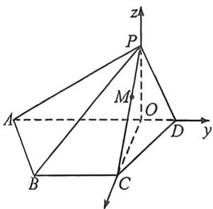
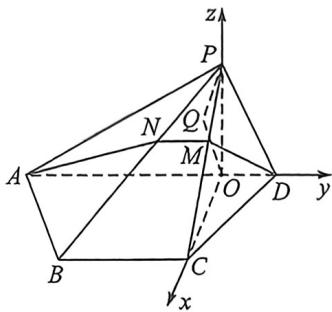
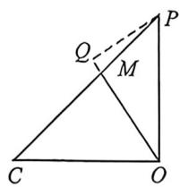

> [!faq]- 例题解析
>
> > [!success]- **【答案】** 详见解析
>
> > [!note]- **【解析】**
> > 解析 (4)如图, 连接 $BD, AD$ , 因为 $AB = DE$ 且 $AB // DE, AE \perp DE$ , 故四边形 $ABDE$ 为矩形, 因为 $DE = 1, AE = \sqrt{3}$ , 由勾股定理得 $AD = 2$ , 且 $\angle EAD = \angle BDA = 30^\circ$ , 又 $BD = \sqrt{3} BC = \sqrt{3} CD$ , 由余弦定理得 $\cos \angle BCD = \frac{BC^2 + CD^2 - BD^2}{2BC \cdot CD} = -\frac{1}{2}$ , 所以 $\angle BCD = 120^\circ, \angle CBD = \angle CDB = 30^\circ$ , 所以 $\angle ADC = \angle ADE = 60^\circ$ ,
> >
> > 连接 $CE$ 交 $AD$ 于点 $O$ , 则等腰三角形 $CDE$ 中, $OD$ 为角平分线, 也是垂线, 所以 $AD \perp CE$ . 折叠之后有 $AD \perp OP$ , $AD \perp OC$ , $OP \cap OC = O$ , $OP$ , $OC \subset$ 平面 $POC$ , 所以 $AD \perp$ 平面 $POC$ , 又 $PC \subset$ 平面 $POC$ , 所以 $AD \perp PC$ .
> >
> > $$
> > A B C D = A D, O P \perp A D, O P \subset
> > $$
> >
> > 所以 $OP \perp$ 平面 ABCD，又 OC, $OD \subset$ 平面 ABCD，故 $OP \perp OC, OP \perp OD$ ，又 $OC \perp OD$ ，所以 OC, OD, OP 两两垂直，以点 O 为坐标原点，OC, OD, OP 所在直线分别为 x, y, z 轴建立空间直角坐标系，
> >
> > 
> >
> > 由于 $OP = OC = \frac{\sqrt{3}}{2}, OD = \frac{1}{2}, OA = \frac{3}{2}, P\left(0,0,\frac{\sqrt{3}}{2}\right), A\left(0, -\frac{3}{2}, 0\right), B\left(\frac{\sqrt{3}}{2}, -1, 0\right), C\left(\frac{\sqrt{3}}{2}, 0, 0\right), D\left(0, \frac{1}{2}, 0\right), \overrightarrow{AP} =$ $\left(0, \frac{3}{2}, \frac{\sqrt{3}}{2}\right), \overrightarrow{AB} = \left(\frac{\sqrt{3}}{2}, \frac{1}{2}, 0\right), \overrightarrow{PC} = \left(\frac{\sqrt{3}}{2}, 0, -\frac{\sqrt{3}}{2}\right), \overrightarrow{PD} = \left(0, \frac{1}{2}, -\frac{\sqrt{3}}{2}\right)$ ，设平面 $PAB$ 的一个法向量为 $n_1 = (x, y, x)$ ，则 $\left\{ \begin{array}{l} n_1 \cdot \overrightarrow{AP} = \frac{3y}{2} + \frac{\sqrt{3}x}{2} = 0 \\ n_1 \cdot \overrightarrow{AB} = \frac{\sqrt{3}x}{2} + \frac{y}{2} = 0 \end{array} \right.$ ，取 $x = 1$ ，则 $n_1 = (1, -\sqrt{3}, 3)$ ，设平面 $PCD$ 的一个法向量为 $n_2 = (a, b, c)$ ，则$\left\{ \begin{array}{l} n_{2} \cdot \overrightarrow{PC} = \frac{\sqrt{3}a}{2} - \frac{\sqrt{3}c}{2} = 0 \\ n_{2} \cdot \overrightarrow{PD} = \frac{b}{2} - \frac{\sqrt{3}c}{2} = 0 \end{array} \right.$ ，取 $a = 1$ ，则 $n_{2} = (1, \sqrt{3}, 1)$ ，设平面 $PAB$ 与平面 $PCD$ 所成角为 $\theta, \theta \in \left[0, \frac{\pi}{2}\right]$ ，
> >
> > $$
> > \cos \theta = | \cos \langle n _ {1}, n _ {2} \rangle | = \frac {| n _ {1} \cdot n _ {2} |}{| n _ {1} | | n _ {2} |} = \frac {1}{\sqrt {1 3} \times \sqrt {5}} = \frac {\sqrt {6 5}}{6 5}
> > $$
> >
> > $$
> > \frac {\sqrt {6 5}}{6 5}
> > $$
> >
> > (Ⅱ)设平面 ADM 交直线 PB 于点 N，连接 OM, DM, MN, AN，因为 BC // AD, BC ∩ 平面 ADM, AD ⊆ 平面 ADM，所以 BC // 平面 ADM, BC ⊆ 平面 PBC，平面 PBC ∩ 平面 ADM = MN，所以 BC // MN // AD，
> > 设 $\overrightarrow{PM}=\lambda\overrightarrow{PC},\lambda\in[0,1]$ ，则由 $\triangle PMN\sim\triangle PCB$ 得 $MN=\lambda BC=\lambda,AD=2$ ，由(1)知 $AD\perp$ 平面 $POC,OM\subset$ 平面 $POC$ ，所以 $AD\perp OM$ ，在平面 $POC$ 内过点P作 $PQ\perp OM$ 于点Q，则 $PQ\subset$ 平面 $POC$ ，所以 $AD\perp PQ$ ，
> > 因为 $AD\cap OM=O,AD,OM\subset$ 平面ADM，所以 $PQ\perp$ 平面ADM，
> >
> > 
> >
> > 
> >
> > 因为平面 ADM 将四棱锥 P-ABCD 分成的含有点 P 的部分为四棱锥 P-ADMN，设梯形 ADMN 的面积为 S，故 $V_{1}=\frac{1}{3}\cdot PQ\cdot S=\frac{1}{3}\cdot PQ\cdot\frac{2+\lambda}{2}\cdot OM=\frac{2+\lambda}{3}\cdot\frac{PQ\cdot OM}{2}=\frac{2+\lambda}{3}\cdot S_{\triangle FOM}$ ，因为 $\overrightarrow{PM}=\lambda\overrightarrow{PC}$ ，所以 $S_{\triangle FOM}=\lambda S_{\triangle FOC}=\lambda\cdot\frac{1}{2}\times\left(\frac{\sqrt{3}}{2}\right)^{2}=\frac{3\lambda}{8}$ ，所以 $V_{1}=\frac{\lambda(2+\lambda)}{8}$ ，设梯形 ABCD 的面积为 $S_{1}$ ，四棱锥 P-ABCD 的体积为 $V=\frac{1}{3}\cdot PO\cdot S_{1}=\frac{1}{3}\times\frac{\sqrt{3}}{2}\times\frac{2+1}{2}\times\frac{\sqrt{3}}{2}=\frac{3}{8}$ ，由题意， $V_{1}=\frac{\lambda(2+\lambda)}{8}=\frac{8}{8+17}V=\frac{3}{25}$ ，整理得 $(5\lambda-2)(5\lambda+12)=0$ ，因为 $\lambda\in[0,1]$ ，所以 $\lambda=\frac{2}{5}$ ，所以 M 到平面 ABCD 的距离 $d=(1-\lambda)PO=\frac{3}{5}\times\frac{\sqrt{3}}{2}=\frac{3\sqrt{3}}{10}$
