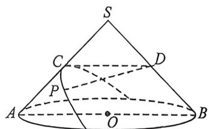
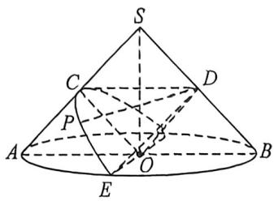
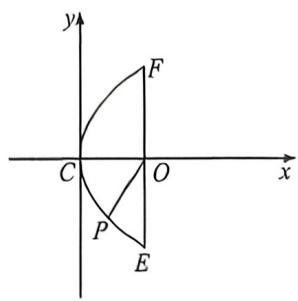

<!-- question-source:start -->
例40 (2025·福建福州·三模)如图,已知 Rt△SAB 是圆锥 SO 的轴截面,C,D 分别为 SA,SB 的中点,过点 C 且与直线 SA 垂直的平面截圆锥,截口曲线 Γ 是抛物线的一部分.若 P 在 Γ 上,则 $\frac{DP}{DC}$ 的最大值为 \_\_\_\_.

<!-- question-source:end -->

![[高中/总复习/二轮/2026版高中《MST新思路思维拓展》二轮复习专题/上册/立体几何/考点六_立体几何中的隐藏二次曲线/questions/answers/Q00093181A1.md]]
