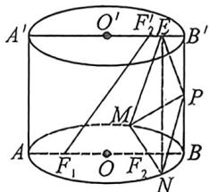
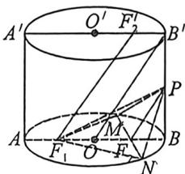
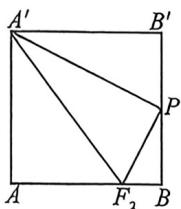
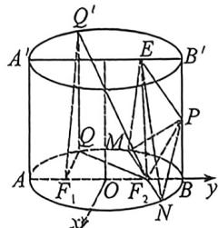

<!-- question-source:start -->
例46 (2025 届湖北省“新八校”协作体高三下学期 5 月联考 T18) 把底面为椭圆且母线与底面垂直的柱体称为“椭圆柱”. 如图, 椭圆柱 $OO'$ 中底面长轴 $AB = A'B' = 4$ , 短轴长 $2\sqrt{3}$ , $F_1$ , $F_2$ 为下底面椭圆的左右焦点, $F'_2$ 为上底面椭圆的右焦点, $AA' = 4$ , $P$ 为 $BB'$ 上的中点, $E$ 为线段 $A'B'$ 上的动点, $MN$ 为过点 $F_2$ 的下底面的一条动弦 (不与 $AB$ 重合).

(1) 求证: $F_{1}F'_{2}$ 平面 PMN.

(2)若点 $Q$ 是下底面椭圆上的动点, $Q'$ 是点 $Q$ 在上底面的投影, 且 $Q'F_1, Q'F_2$ 与下底面所成的角分别为 $\alpha, \beta$ , 试求出 $\tan (\alpha + \beta)$ 的最小值.

(3)求三棱锥 E-PMN 的体积的取值范围.
<!-- question-source:end -->

![[高中/总复习/二轮/2026版高中《MST新思路思维拓展》二轮复习专题/上册/立体几何/考点六_立体几何中的隐藏二次曲线/questions/answers/Q00093182A1.md]]
