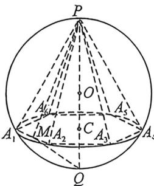
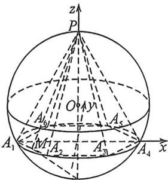
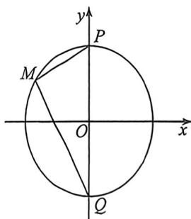

<!-- question-source:start -->
例43 (2025·南昌9月开学考,T19)如图,球O的半径为4,PQ是球O的一条直径,C是线段PQ上的动点,过点C且与PQ垂直的平面与球O的球面交于 $\odot C,A_{1}A_{2}\cdots A_{6}$ 是 $\odot C$ 的一个内接正六边形.

(1)若 $C$ 是 $OQ$ 的中点.

(i) 求六棱锥 $P-A_{1}A_{2}\cdots A_{6}$ 的体积；

(ii) 求二面角 $A_{1}-PA_{3}-A_{2}$ 的余弦值；

(2)设 ${A}_{1}{A}_{2}$ 的中点为 $M$ ,求证: $\tan \angle {MPQ} \cdot  \tan \angle {MQP}$ 为定值.
<!-- question-source:end -->

![[高中/总复习/二轮/2026版高中《MST新思路思维拓展》二轮复习专题/上册/立体几何/考点六_立体几何中的隐藏二次曲线/questions/answers/Q00093319A1.md]]
