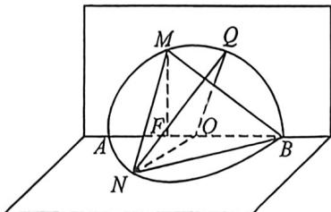

<!-- question-source:start -->
例45 (江苏省部分学校2026届高三上学期入学考试T18)已知 $\odot O$ 圆心在原点, 且与直线 $x + y - 3\sqrt{2} = 0$ 相切, 它与 $x$ 轴分别相交于 $A, B$ , 过点 $F(-1,0)$ 的直线 $l$ 交圆 $O$ 于 $M, N$ .

(1)求弦长 $MN$ 的最小值, 并求此时直线 $l$ 的方程;

(2)当 $\triangle OMN$ 的面积 $S_{\triangle OMN}$ 取得最大值时，将圆 $O$ 沿 $x$ 轴折成直二面角，如图，在上半圆上是否存在点 $Q$ , 使平面 $ONQ$ 与平面 $BMN$ 的夹角的正弦值为 $\frac{\sqrt{15}}{5}$ , 若存在, 求 $OQ$ 的长, 若不存在, 说明理由: (3) 在圆 $O$ 上任取一点 $C$ , 过 $C$ 作 $x$ 轴的垂线段 $CD, D$ 为垂足, 当 $C$ 在圆上运动时, 线段 $CD$ 的中点的轨迹记为曲线 $\tau$ , 曲线 $\tau$ 与直线 $l$ 交于 $G, H$ , 直线 $GA$ 与直线 $HB$ 相交于 $S, S$ 在定直线 $l_1$ 上, 直线 $MA$ 与直线 $BN$ 相交于 $T, T$ 在定直线 $l_2$ 上, 判断直线 $l_1, l_2$ 的位置关系, 并证明.
<!-- question-source:end -->

![[高中/总复习/二轮/2026版高中《MST新思路思维拓展》二轮复习专题/上册/立体几何/考点六_立体几何中的隐藏二次曲线/questions/answers/Q00093320A1.md]]
