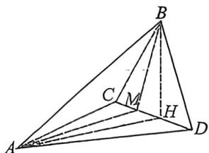
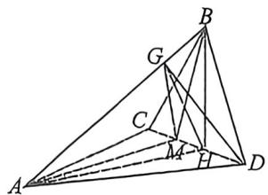
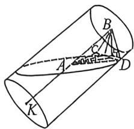
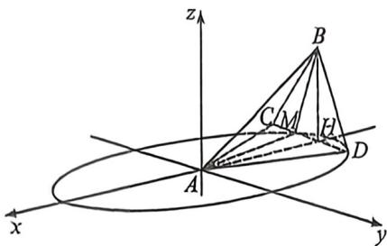

> [!faq]- 例题解析
>
> > [!success]- **【答案】** 详见解析
>
> > [!note]- **【解析】**
> > 解析 (1) 由题设, 长轴长 $|AB| = |A'B'| = 4$ , 短轴长 $2\sqrt{3}$ , 则 $|OF_1| = |OF_2| = |O'F'_2| = 1$ , 所以 $F_2, F'_2$ 分别是
> >
> > $OB, O'B'$ 的中点，而柱体中 $ABB'A'$ 为矩形，连接 $OB'$ ，由 $B'F'_2OF_1, |B'F'_2| = |OF_1| = 1$ ，故四边形 $F_1OB'F'_2$ 为平行四边形，则 $OB'F_1F'_2$ ，当 $P$ 为 $BB'$ 的中点时，则 $PF_2OB'$ ，故 $PF_2F_1F'_2, PF_2 \subset$ 面 $PMN, F_1F'_2 \subset$ 面 $PMN$ ，故 $F_1F'_2$ 平面 $PMN$ .
> >
> > (2)由题设, 令 $|QF_1| = m$ , $|QF_2| = n$ , 则 $m + n = 4$ , 又 $|QQ'| = 4$ , 所以 $\tan \alpha = \frac{4}{m}, \tan \beta = \frac{4}{n}$ , 则 $\tan (\alpha + \beta) = \frac{\tan \alpha + \tan \beta}{1 - \tan \alpha \tan \beta} = \frac{4(m + n)}{mn - 16} = \frac{16}{mn - 16}$ , 因为 $mn \leqslant \left(\frac{m + n}{2}\right)^2 = 4$ , 当且仅当 $m = n$ , 即 $\tan \alpha = \tan \beta$ 上式取等号, 所以 $1 > \tan (\alpha + \beta) \geqslant -\frac{4}{3}$ , 所以 $\tan (\alpha + \beta)$ 的最小值为 $-\frac{4}{3}$ .
> >
> > (3)由 $V_{E - PMN} = V_{M - PEF_1} + V_{N - PEF_2}$ ，正方形 $ABB^{\prime}A^{\prime}$ 中 $P$ 为中点，易得 $E$ 与 $A^{\prime}$ 重合时 $F_{2}P$ 与 $EP$ 垂直，
> >
> > 此时 $PF_{2} = \sqrt{5}, EP = \sqrt{20}$ , 则 $S_{\triangle PEF_{1}}$ 最大值为 $\frac{1}{2}\sqrt{5} \cdot \sqrt{20} = 5$ , 构建如上图空间直角坐标系且 $B(0,2)$ , 底面椭圆方程为 $\frac{y^{2}}{4} + \frac{x^{2}}{3} = 1, V_{E - PMN} = V_{M - PEF_{1}} + V_{N - PEF_{1}} = \frac{1}{3} S_{\triangle PEF_{1}} \cdot |MN| \sin \angle MF_{2}F_{1}$ , 令 $\angle MF_{2}F_{1} = \theta$ , 利用焦长公式 (自证) $|MN| = \frac{2ab^{2}}{b^{2} + c^{2}\sin^{2}\theta} = \frac{12}{3 + \sin^{2}\theta}$ , 所以 $\frac{1}{3} S_{\triangle PEF_{1}} \cdot |MN| \sin \angle MF_{2}F_{1} = \frac{1}{3} S_{\triangle PEF_{1}} \cdot \frac{12}{\frac{3}{\sin\theta} + \sin\theta} \leqslant 5$ , 当且仅当 $\sin\theta = 1$ 时候取等, 综上, $V_{E - PMN} \in (0,5]$ .
> >
> > 例(2025·广东揭阳三模T19)如图,三棱锥A-BCD中,点B在平面ACD的射影H恰在CD上,M为
> >
> > $HC$ 中点， $\angle BAH = \frac{\pi}{6},AB = 2,S_{\triangle ABM} = S_{\triangle ABD} = 1.$
> >
> > (1)若 $CD \perp$ 平面 $BAH$ , 证明: $M$ 是 $CD$ 的三等分点;
> >
> > (2)记 D 的轨迹为曲线 W, 判断 W 是什么曲线, 并说明理由;
> >
> > 
> >
> > (3)求 $CD$ 的最小值.
> >
> > 解析 (1)由于 $CD \perp$ 平面 $BAH$ , 作 $HG \perp AB$ , 垂足为点 $G$ , 因为 $AB \subset$ 平面 $BAH$ , 则 $CD \perp AB$ ,
> >
> > 又因为 $HG \perp AB$ ，且 $GH \cap MH = H, MH, GH \subset$ 平面 $GMH$ ，因此 $AB \perp$ 平面 $GMH$ ，因为 $GM \subset$ 平面 $GMH$ ，所以 $AB \perp GM$ ，同理可证： $AB \perp GD$ ，又因为 $S_{\triangle ABM} = S_{\triangle ABD}$ ，可得 $\frac{1}{2} AB \cdot GM = \frac{1}{2} AB \cdot GD$ ，所以 $GM = GD$ ，
> >
> > 因为 $GH \subset$ 面 $ABH$ , 从而 $MD \perp GH$ , 因此 $DH = MH = MC$ , 进而 $M$ 为 $DC$ 的三等分点.
> >
> > 
> >
> > 
> >
> > (2)椭圆,延长 $BA$ 至 $K$ ,使得 $AK = AB$ ,由于 $S_{\triangle ABM} = S_{\triangle ABD} = 1$ ,可得 $M, D$ 到 $AB$ 的距离为定值,因此 $M, D$ 应在以 $AK$ 为高线的圆柱上运动,且上下底面与 $AK$ 垂直,又因为 $M, D$ 为平面 $ACD$ 上两点, $\angle BAH = \frac{\pi}{6}$ ,从而 $M, D$ 的运动平面截得该圆柱,根据圆锥曲线的定义,因而 $M, D$ 的运动轨迹应为椭圆.
> >
> > 
> >
> > (3)以 $A$ 为原点, $HA$ 所在直线为 $x$ 轴, 过 $A$ 点与 $HB$ 平行的直线为 $z$ 轴, 建立空间直角坐标系, 如图所示,
> >
> > 下面求椭圆方程:一方面,由于该圆柱的底面半径为 r=1,故由图可知椭圆的短半轴长为 1,由 $\angle BAH=\frac{\pi}{6}$ ,从而椭圆的长半轴 $a=\frac{r}{\sin\frac{\pi}{6}}=2r=2$ ,进而椭圆方程 $E:\frac{x^{2}}{4}+y^{2}=1$ ,
> >
> > 又由 $\angle BAH = \frac{\pi}{6}, BH \perp$ 平面 $ACD$ , 从而 $HA = AB\cos \frac{\pi}{6} = \sqrt{3}$ , 即 $H(-\sqrt{3}, 0, 0)$ , 由定义知 $H$ 为椭圆的左焦点, 设 $E$ 的右焦点为 $F(\sqrt{3}, 0, 0)$ , 则 $FD = 4 - DH$ , 设 $\angle DHA = \theta$ , 在 $\triangle DHF$ 中, 由余弦定理, 可得 $HF^2 + HD^2 - 2FH \cdot DH\cos \theta = FD^2$ , 解得 $DH = \frac{1}{2 - \sqrt{3}\cos\theta}$ , 同理可得: $MH = \frac{1}{2 + \sqrt{3}\cos\theta}$ ,
> >
> > 由 $\frac{1}{MH} +\frac{1}{DH} = 4$ ，原题等价于求 $2MH + DH$ 的最小值，则等价于求 $\frac{1}{4}\left(\frac{1}{MH} +\frac{1}{DH}\right)(2MH + DH)$ 的最小值，又由 $\frac{1}{4}\left(\frac{1}{MH} +\frac{1}{DH}\right)(2MH + DH) = \frac{1}{4}\left(\frac{2MH}{DH} +\frac{DH}{MH} +3\right)\geqslant \frac{3 + 2\sqrt{2}}{4}$ ，当且仅当 $DH = \sqrt{2} MH$ 时等号成立，因此 $CD$ 的最小值为 $\frac{3 + 2\sqrt{2}}{4}$
> >
> > 注意 斜椭圆的计算中,重在考查空间思维能力,计算部分相对要求不高,不过对于焦长公式,焦半径的考查就比较常见。
