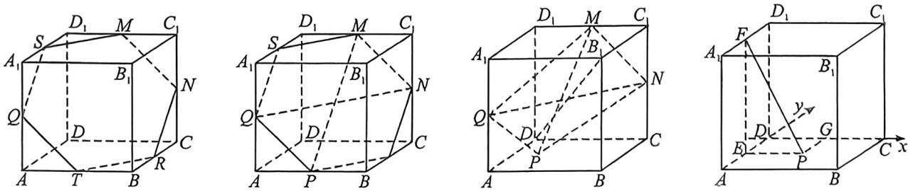

> [!faq]- 例题解析
>
> > [!success]- **【答案】** ACD
>
> > [!note]- **【解析】**
> > 解析 如图所示,作出各边中点,在正方体中,根据三角形中位线的关系,可知 QT//MN,SQ//NR,SM//TR,
> >
> > 
> >
> > 且截面各边长都是相等的,是正六边形,所以 A 正确.
> >
> > 当点 P 在 AB 中点上时, PQ 与 MN 相交, 此时共面, 所以 B 错误.
> >
> > 正方体边长为2，则线段 $MN = \sqrt{2}$ ，当正六边形边长为 $\sqrt{2}$ 时，可知其对角线 $QM = \sqrt{6}, QN = 2\sqrt{2}$ ，所以 $QN^2 = QM^2 +$
> >
> >
> > $MN^2$ ，所以 $\triangle QMN$ 为直角三角形，可得 $S_{\triangle QMN} = \frac{1}{2}\times \sqrt{6}\times \sqrt{2} = \sqrt{3}$ ，当 $P$ 与点 $D$ 重合时，体积最大，此时三棱锥的高为 $\frac{1}{2}|DB_1| = \frac{1}{2}\times 2\sqrt{3} = \sqrt{3}$ ，此时体积为 $\frac{1}{3}\times \sqrt{3}\times \sqrt{3} = 1$ ，所以C正确.
> >
> > 图所示, 过 $P$ 作 $PG \perp CD$ 于 $G$ , 过 $P$ 作 $PE \perp AD$ 于 $E$ , 作 $EF \perp A_1 D_1$ 于 $F$ , 连接 $PF$ , 以 $D$ 为坐标原点, 以 $DC, AD$ 为 $x, y$ 轴, 建立平面直角坐标系, 设 $P(x, y)$ , 则 $PF = \sqrt{x^2 + 4}$ , $PG = |y|$ , 当 $P$ 到棱 $CD, A_1 D_1$ 距离相等时, $\sqrt{x^2 + 4} = |y|$ , 化简得 $\frac{y^2}{4} - \frac{x^2}{4} = 1$ , 是双曲线轨迹, 所以 $D$ 正确.
> >
> > 故选 **ACD**.
