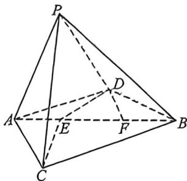
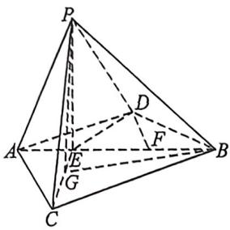
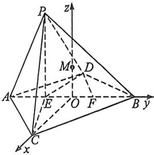

> [!faq]- 例题解析
>
> > [!success]- **【答案】** 详见解析
>
> > [!note]- **【解析】**
> > 解析 ①(1)因为 O 到 $\odot C$ 的距离为 2，所以 $\odot C$ 的半径为 $\sqrt{4^{2}-2^{2}}=2\sqrt{3}$ ，所以正六边形 $A_{1}A_{2}\cdots A_{6}$ 的边长为 $2\sqrt{3}$ ，所以正六边形 $A_{1}A_{2}\cdots A_{6}$ 的面积为 $6\times\frac{\sqrt{3}}{4}\times(2\sqrt{3})^{2}=18\sqrt{3}$ ，且 P 到 $\odot C$ 的距离为 6，所以六棱锥 $P-A_{1}A_{2}\cdots A_{6}$ 的体积为 $\frac{1}{3}\times18\sqrt{3}\times6=36\sqrt{3}$ ; (Ⅱ)以 C 为原点， $A_{1}A_{4}$ 为 x 轴， $A_{1}A_{4}$ 的中垂线为 y 轴，PQ 为 z 轴建系，
> >
> > 则 $P(0,0,6), A_1(-2\sqrt{3},0,0), A_2(-\sqrt{3},-3,0), A_3(\sqrt{3},-3,0)$ ，所以 $\overrightarrow{A_1P} = (2\sqrt{3},0,6), \overrightarrow{A_3P} = (-\sqrt{3},3,6), \overrightarrow{A_2A_3} = (2\sqrt{3},0,0)$ ，设平面 $PA_1A_3$ 的一个法向量 $n_1 = (x_1,y_1,z_1)$ ，
> >
> > 则 $\left\{ \begin{array}{l} n_{1} \cdot \overrightarrow{A_{1}P} = 0 \Rightarrow 2\sqrt{3} x_{1} + 6z_{1} = 0 \\ n_{1} \cdot \overrightarrow{A_{3}P} = 0 \Rightarrow -\sqrt{3} x_{1} + 3y_{1} + 6z_{1} = 0 \end{array} \right.$ 令 $z_{1} = 1$ ，得 $n_{1} = (-\sqrt{3}, -3, 1)$ ，设平面 $PA_{2}A_{3}$ 的一个法向量 $n_{2} =$
> >
> > $(x_{2},y_{2},z_{2})$ 则 $\left\{\begin{aligned}n_{2}\cdot\overrightarrow{A_{2}A_{3}}&=0\Rightarrow2\sqrt{3}x_{2}=0\\ n_{2}\cdot\overrightarrow{A_{3}P}&=0\Rightarrow-\sqrt{3}x_{2}+3y_{2}+6z_{2}=0\end{aligned}\right.$ ，令 $z_{2}=1$ ，得 $n_{2}=(0,-2,1)$ ，
> >
> > 所以 $\cos n_1, n_2 = \frac{n_1 \cdot n_2}{|n_1| \cdot |n_2|} = \frac{0 + 6 + 1}{\sqrt{13} \cdot \sqrt{5}} = \frac{7\sqrt{65}}{65}$ .
> >
> > (2)由已知， $M$ 点在过 $PQ$ 且与 $\odot C$ 所在平面垂直的一个平面内，记这个平面为 $\alpha$ 。在平面 $\alpha$ 内，以 $O$ 为坐标原点，以 $PQ$ 为 $y$ 轴，以 $PQ$ 中垂线为 $x$ 轴建立平面直角坐标系，设 $M(x, y)$ ，则 $|x| = |MC| = \frac{\sqrt{3}}{2} |CA_1|$ ， $|y| = |OC|$ ，因为 $|CA_1|^2 + |OC|^2 = 16$ ，所以 $\frac{4}{3} x^2 + y^2 = 16$ ，即 $\frac{x^2}{12} + \frac{y^2}{16} = 1$ ，又 $P, Q$ 的坐标分别为 $(0, 4), (0, -4)$ ，所以 $\tan \angle MPQ * \tan \angle MQP = \frac{x}{4 + y} \cdot \frac{x}{4 - y} = \frac{x^2}{16 - y^2} = \frac{x^2}{\frac{4}{3} x^2} = \frac{3}{4}$
> >
> > 例(2026届安徽江淮十校高三第一次联考(8月),T18)三棱锥 P-ABC 中, $CA=CB=2\sqrt{2}$ ,AB=4,PA= $\sqrt{10}$ .点 P 在底面 ABC 上的射影 E 是线段 AB 上靠近点 A 的四等分点.
> >
> > (1)求 $PB$ 与平面 $PCE$ 所成角的正弦值;
> >
> > (2)求三棱锥 P-ABC 外接球表面积；
> >
> > (3)设 $AB$ 靠近 $B$ 的四等分点为 $F, D$ 是平面 $ABC$ 内的动点, 且 $C, D$ 在直线 $AB$ 的两侧, 满足 $|DE| + |DF| = 4$ . 试探究是否存在点 $D$ 使得平面 $PBD \perp$ 平面 $PBC$ ? 若存在, 请求出 $DE$ 的长度; 若不存在, 请说明理由.
> >
> > 
> >
> > 解析 (1) 法一: 连接 $PE$ , 由题意 $AE = 1, PE = \sqrt{(\sqrt{10})^2 - 1^2} = 3, PB = \sqrt{3^2 + 3^2} = 3\sqrt{2}$ , 因 $CA = CB = 2\sqrt{2}, AB = 4$ , 则 $CA^2 + CB^2 = AB^2$ , 即 $\triangle ACB$ 是等腰直角三角形, 故 $\angle CAE = 45^\circ$ , 在 $\triangle ACE$ 中, 由余弦定理: $CE = \sqrt{CA^2 + AE^2 - 2CA \times AE \times \cos 45^\circ} = \sqrt{8 + 1 - 2 \times 2\sqrt{2} \times 1 \times \frac{\sqrt{2}}{2}} = \sqrt{5}$ ,
> >
> > $$
> > S _ {\triangle B C E} = \frac {1}{2} \times C E \times P E = \frac {1}{2} \times \sqrt {5} \times = \frac {3 \sqrt {5}}{2}, S _ {\triangle B C E} = \frac {1}{2} \times C E \times B E = \frac {1}{2} \times 2 \sqrt {2} \times 3 \times \frac {\sqrt {2}}{2} = 3,
> > $$
> >
> > 设 $h_B$ 为 $B$ 到平面 $PCE$ 的距离，由 $V_{B - PCE} = V_{P - BCE}$ ，可得： $\frac{1}{2} S_{\triangle FCE} \cdot h_B = \frac{1}{3} S_{\triangle BCE} \cdot PE$ ，即： $h_B = \frac{S_{\triangle BCE} \cdot PE}{S_{\triangle FCE}} = \frac{3 \times 3}{\frac{3\sqrt{5}}{2}} =$
> >
> > $\frac{6\sqrt{5}}{5}$ , 设 $PB$ 与平面 $PCE$ 所成角为 $\theta$ , 则 $\sin \theta = \frac{h_B}{PB} = \frac{\frac{6\sqrt{5}}{5}}{3\sqrt{2}} = \frac{\sqrt{10}}{5}$ , 即直线 $PB$ 与平面 $PCE$ 所成角的正弦值为 $\frac{\sqrt{10}}{5}$ . 法二: 连接 $PE$ , 因为 $P$ 在底面 $ABC$ 上的射影 $E$ 是线段 $AB$ 靠近点 $A$ 的四等分点, 可得 $PE \perp$ 平面 $ABC$ , 因 $ABC \subset$ 平面 $ABC$ , 所以 $PE \perp AB$ , 在直角 $\triangle PAE$ 中, 可得 $PE = \sqrt{PA^2 - AE^2} = 3$ , 又因为 $PE \subset$ 平面 $PEC$ , 所以平面 $PEC \perp$ 平面 $ABC$ , 且交线为 $CE$ , 过 $B$ 作 $BG \perp CE$ 于点 $G$ , 连接 $PG$ , 因为 $BG \subset$ 平面 $ABC$ , 由面面垂直的性质, 可得 $BG \perp$ 平面 $PEC$ , 故 $\angle BPG$ 为 $PB$ 与平面 $PCE$ 的所成角, 在 $\triangle BCE$ 中, $CB = 2\sqrt{2}$ , $BE = 3$ , $\angle CBE = 45^\circ$ , 由余弦定理得 $CE^2 = CB^2 + BE^2 - 2CB \cdot BE\cos \angle CBE = 5$ , 所以 $CE = \sqrt{5}$ , 又由 $S_{\triangle BCE} = \frac{1}{2} CE \cdot BG = \frac{1}{2} BC \cdot BE\sin 45^\circ$ , 解得 $BG = \frac{6}{5}\sqrt{5}$ , 在 $\triangle BPC$ 中, 由 $PB = \sqrt{PE^2 + BE^2} = 3\sqrt{2}$ , 所以 $\sin \angle BPG = \frac{BG}{BP} = \frac{\frac{6\sqrt{5}}{5}}{3\sqrt{2}} = \frac{\sqrt{10}}{5}$ , 即直线 $PB$ 与平面 $PCE$ 所成角的正弦
> >
> >
> > 值为 $\frac{\sqrt{10}}{5}$ .
> >
> > 
> >
> > 
> >
> > (2)因 $AC \perp CB$ ，则三棱锥 P-ABC 外接球的球心 M 在过 AB 中点 O 且与平面 CAB 垂直的垂线上，以点 O 为坐标原点，OC, BO 所在直线为 x, y 轴，过点 O 平行于 PE 的直线为 z 轴建立空间直角坐标系，
> >
> > 则 $A(0, -2, 0), P(0, -1, 3)$ , 设三棱锥 $P - ABC$ 外接球的半径为 $R$ , 设 $M(0, 0, t)$ , 由 $|MA| = |MP| = R$ , 所以 $4 + t^2 = 1 + (t - 3)^2 = R^2$ , 所以 $t = 1$ , 故 $M(0, 0, 1), R = \sqrt{5}$ , 故三棱锥 $P - ABC$ 外接球的表面积为 $S = 4\pi R^2 = 20\pi$ .
> >
> > (3)依题意, $C(2,0,0)$ , $B(0,2,0)$ , $E(0,-1,0)$ , $F(0,1,0)$ , $P(0,-1,3)$ ,设 $D(a,b,0)(a<0)$ ，由 $|DE|+|DF|=4>|EF|=2$ ，所以在平面xOy中，点D在以E、F为焦点的椭圆上，则 $\frac{b^{2}}{4}+\frac{a^{2}}{3}=1(*)$ ,
> >
> > 设平面 $PBC$ 的法向量 $\pmb{n}_{1} = (x_{1},y_{1},z_{1})$ ，因 $\overrightarrow{PB} = (0,3, - 3),\overrightarrow{PC} = (2,1, - 3)$ ，因 $\left\{ \begin{array}{l}\overrightarrow{PB}\cdot \pmb {n}_1 = 0\\ \overrightarrow{PC}\cdot \pmb {n}_1 = 0 \end{array} \right.$ 即 $\left\{ \begin{array}{l}3y_{1} - 3z_{1} = 0\\ 2x_{1} + y_{1} - 3z_{1} = 0 \end{array} \right.$ ，故可取 $\pmb {n}_{1} = (1,1,1)$ ，设平面 $PBD$ 的法向量 $\pmb {n}_2 = (x_2,y_2,z_2)$ ，因 $\overrightarrow{BD} = (a,b - 2,0),\overrightarrow{PD} = (a,b+$ $1, - 3)$ ，由 $\left\{ \begin{array}{l}\overrightarrow{BD}\cdot \pmb {n}_2 = 0\\ \overrightarrow{PD}\cdot \pmb {n}_2 = 0 \end{array} \right.$ ，所以 $\left\{ \begin{array}{l}ax_2 + (b - 2)y_2 = 0\\ ax_2 + (b + 1)y_2 - 3z_2 = 0 \end{array} \right.$ 故可取，由 $\pmb {n}_{1}\cdot \pmb{n}_{2} = 0$ 可得 $b = 2a + 2$ ，将其代入（\*），解得 $\left\{ \begin{array}{l}a = 0\\ b = 2 \end{array} \right.$ （舍）或 $\left\{ \begin{array}{l}a = -\frac{3}{2}\\ b = -1 \end{array} \right.$ 此时 $D\left(-\frac{3}{2}, - 1,0\right)$ .而 $E(0, - 1,0)$ ，故 $|ED| = \frac{3}{2}$
