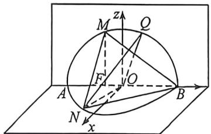
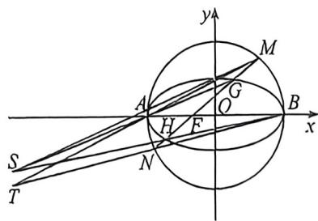

> [!faq]- 例题解析
>
> > [!success]- **【答案】** 详见解析
>
> > [!note]- **【解析】**
> > 解析 (1) 由题意得圆的半径 $r = \frac{| - 3\sqrt{2}|}{\sqrt{1 + 1}} = 3$ ，则圆 $O$ 的方程为 $x^{2} + y^{2} = 9$ ，当直线 $l$ 的斜率为 0 时，此时 $|MN| = 6$ ，当直线 $l$ 的斜率不为 0，设 $l: x = my - 1$ ，即 $x - my + 1 = 0$ ，则圆心到直线的距离 $d = \frac{1}{\sqrt{m^2 + 1}}$ ，
> >
> > 又 $|MN| = 2\sqrt{r^2 - d^2} = 2\sqrt{9 - \frac{1}{m^2 + 1}} \geqslant 4\sqrt{2}$ ，当且仅当 $m = 0$ 时等号成立，此时直线 $l$ 的方程为 $x = -1$
> >
> > 所以弦长 MN 的最小值为 $4\sqrt{2}$ ，直线 l 的方程为 x = -1。
> >
> > (2)易知直线 l 的斜率不为 0，设 l: x = my - 1，即 $x - my + 1 = 0$ ，由 (1)， $|MN| = 2\sqrt{9 - \frac{1}{m^{2} + 1}}$ ， $d = \frac{1}{\sqrt{m^{2} + 1}}$ ，又 $S_{\triangle OMN} = \frac{1}{2} |MN| \cdot d$ ，化简得 $S_{\triangle OMN} = \frac{\sqrt{9m^{2} + 8}}{m^{2} + 1}$ ，令 $\sqrt{9m^{2} + 8} = t (t \geqslant 2\sqrt{2})$ ，则 $m^{2} + 1 = \frac{t^{2} + 1}{9}$ ，所以 $S_{\triangle OMN} = \frac{9t}{t^{2} + 1} = \frac{9}{t + \frac{1}{t}}$ ，又 $t \geqslant 2\sqrt{2}$ ，故 $S_{\triangle OMN}$ 最大时，由对勾函数的单调性可得 $t = 2\sqrt{2}$ ，故此时 m = 0，
> >
> > 建立空间直角坐标系，如图，则 $M(0, -1, 2\sqrt{2}), N(2\sqrt{2}, -1, 0), B(0, 3, 0)$ ，所以 $\overrightarrow{BM} = (0, -4, 2\sqrt{2}), \overrightarrow{BN} = (2\sqrt{2}, -4, 0)$ ，
> >
> > 设平面 BMN 的法向量为 $\boldsymbol{n}_{1}=(x_{1},y_{1},z_{1})$ ，则 $\left\{\begin{aligned}\boldsymbol{n}_{1}\cdot\overrightarrow{BM}&=0\\ \boldsymbol{n}_{1}\cdot\overrightarrow{BN}&=0\end{aligned}\right.$ ，即 $\left\{\begin{aligned}-4y_{1}+2\sqrt{2}z_{1}&=0\\ 2\sqrt{2}x_{1}-4y_{1}&=0\end{aligned}\right.$ ，取 $y_{1}=1$ ，则 $\boldsymbol{n}_{1}=(\sqrt{2},1,\sqrt{2})$ ，
> > 设 $Q(0,3\cos\theta,3\sin\theta)$ ，其中 $\theta\in(0,\pi)$ ，则 $\overrightarrow{ON}=(2\sqrt{2},-1,0),\overrightarrow{OQ}=(0,3\cos\theta,3\sin\theta)$ ，设平面 ONQ 的法向量为 $n_{2}=(x_{2},y_{2},z_{2})$ ，则 $\left\{\begin{aligned}\boldsymbol{n}_{2}\cdot\overrightarrow{ON}&=0\\ \boldsymbol{n}_{2}\cdot\overrightarrow{OQ}&=0\end{aligned}\right.$ ，即 $\left\{\begin{aligned}2\sqrt{2}x_{1}-y_{1}&=0\\ 3y_{1}\cos\theta-3z_{1}\sin\theta&=0\end{aligned}\right.$ ，取 $x_{1}=\sin\theta$ ，易得 $n_{2}=(\sin\theta,2\sqrt{2}\sin\theta,-2\sqrt{2}\cos\theta)$ ，所以 $|\cos\langle n_{1},n_{2}\rangle|=\left|\frac{3\sqrt{2}\sin\theta-4\cos\theta}{\sqrt{5}\cdot\sqrt{\sin^{2}\theta+8}}\right|=\sqrt{1-\left(\frac{\sqrt{15}}{5}\right)^{2}}=\frac{\sqrt{10}}{5}$ ，解得 $\cos\theta=0$ ，所以 $Q(0,0,3)$ ，则 $|OQ|=3$ 。
> >
> > 
> >
> > 
> >
> > (3) 法一: 设 $l: x = my - 1, M(x_1, y_1), N(x_2, y_2)$ , 联立 $\left\{ \begin{array}{l} x = my - 1 \\ x^2 + y^2 = 9 \end{array} \right.$ , 化简得 $(m^2 + 1)y^2 - 2my - 8 = 0$ 。
> >
> >
> > $\Delta = 4m^{2} + 32(m^{2} + 1) > 0$ ，所以 $y_{1}y_{0} = \frac{-8}{m^{2} + 1},y_{1} + y_{2} = \frac{2m}{m^{2} + 1}$ 所以 $my_{1}y_{2} = -4(y_{1} + y_{2})$
> >
> > 设 $l_{\mathrm{MA}}: \frac{y_1}{x_1 + 3} (x + 3) = y, l_{\mathrm{BN}}: \frac{y_2}{x_2 - 3} (x - 3) = y$ ，联立 $\left\{ \begin{array}{l} \frac{y_1}{x_1 + 3} (x + 3) = y \\ \frac{y_2}{x_2 - 3} (x - 3) = y \end{array} \right.$ ，得 $x = \frac{-3my_1y_2 - 3y_2 + 6y_1}{-2y_1 - y_2}$ ，
> >
> > 又 $my_{1}y_{2} = -4(y_{1} + y_{2})$ ，代入得 $x = \frac{18y_1 + 9y_2}{-2y_1 - y_2} = -9$ ，即点 $T$ 在定直线 $l_{2}:x = -9$ 上，
> >
> > 易得 $\tau: x^2 + 4y^2 = 9$ ，联立 $l: x = my - 1$ ，化简得 $(m^2 + 4)y^2 - 2my - 8 = 0$ ，设 $G(x_3, y_3), H(x_4, y_4)$ ，则 $y_3y_4 = \frac{-8}{m^2 + 4}$ ， $y_3 + y_4 = \frac{2m}{m^2 + 4}$ ，所以 $my_3y_4 = -4(y_3 + y_4)$ ，同理， $S$ 在定直线 $l_1: x = -9$ 上，所以 $l_1$ 与 $l_2$ 重合。
> >
> > 法二(对合):MN: $\frac{x}{3}(1-t_{1}t_{2})+\frac{y}{3}(t_{1}+t_{2})=1+t_{1}t_{2}$ ，过定点 $F(-1,0)$ ，所以 $t_{1}t_{2}=-2,k_{AM}=t_{1},k_{BN}=-\frac{1}{t_{2}}$ ，联立得： $\left\{\begin{aligned}y=t_{1}(x+3)\\ y=-\frac{1}{t_{2}}(x-3)\end{aligned}\right.\Rightarrow x_{T}=-9;$
> >
> > $GH: \frac{x}{3} (1 - t_3 t_4) + \frac{2y}{3} (t_3 + t_4) = 1 + t_3 t_4$ ，过定点 $F(-1,0)$ ，所以 $t_3 t_4 = -2, k_{AG} = \frac{t_3}{2}, k_{BH} = -\frac{1}{2t_4}$ ，联立得： $\left\{ \begin{array}{l} y = \frac{t_3}{2} (x + 3) \\ \Rightarrow x_S = -9; \text{所以 } l_1 \text{ 与 } l_2 \text{ 重合.} \\ y = -\frac{1}{2t_4} (x - 3) \end{array} \right.$
