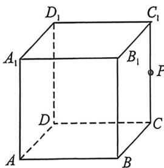
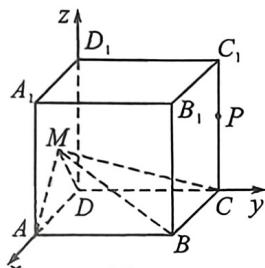
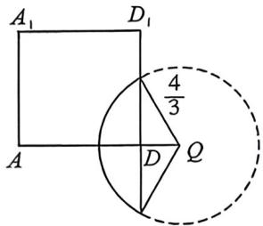
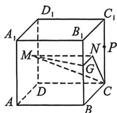
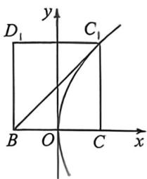

> [!faq]- 例题解析
>
> > [!success]- **【答案】** ACD
>
> > [!note]- **【解析】**
> > $$
> > \lambda + \mu = 1
> > $$
> >
> > $$
> > C M \perp D B _ {1}
> > $$
> >
> > B. 若 $\mu = \frac{1}{2}, \lambda \in [0,1]$ , 则直线 $PM$ 与直线 $BC$ 所成角的最小值为 $60^{\circ}$ C. 若 $\lambda \in [0,1]$ 且. $S_{\triangle MAB} = 2S_{\triangle MDC}$ , 则点 $M$ 的轨迹长为 $\frac{8}{9}\pi$
> >
> > 
> >
> > D. 若动点 $M$ 在平面 $BCC_{1}B_{1}$ 上的投影为点 $N, MC$ 与平面 $BCC_{1}B_{1}$ 所成角
> >
> > 与二面角 $M-BB_{1}-C$ 大小相等, 则直线 $BC_{1}$ 与点 N 的轨迹相切
> >
> > 解析 以 D 为坐标原点, DA, DC, $DD_{1}$ 所在直线为坐标轴建立如图 1 所示的空间直角坐标系, 则 $D(0,0,0)$ , $A(2,0,0)$ , $B(2,2,0)$ , $D_{1}(0,0,2)$ , $B_{1}(2,2,2)$ , $C(0,2,0)$ , 所以 $\overrightarrow{DA}=(2,0,0)$ , $\overrightarrow{DD_{1}}=(0,0,2)$ , 所以 $\overrightarrow{DM}=\lambda\overrightarrow{DA}+\mu\overrightarrow{DD_{1}}=\lambda(2,0,0)+\mu(0,0,2)=(2\lambda,0,2\mu)$ , 即 $M(2\lambda,0,2\mu)$ , 所以 $\overrightarrow{CM}=(2\lambda,-2,2\mu)$ , 又 $\overrightarrow{DB_{1}}=(2,2,2)$ , 所以 $\overrightarrow{CM}\cdot\overrightarrow{DB_{1}}=2\lambda\cdot2+(-2)\times2+2\mu\cdot2=4\lambda-4+4\mu=4(\lambda+\mu)-4$ , 当 $\lambda+\mu=1$ 时, $\overrightarrow{CM}\cdot\overrightarrow{DB_{1}}=0$ , 所以 $\overrightarrow{CM}\perp\overrightarrow{DB_{1}}$ , 所以 $CM\perp DB_{1}$ , 故 A 正确;
> >
> > 点 $P$ 为 $CC_{1}$ 的中点，其坐标为 $(0,2,1)$ ，点 $M$ 的坐标为 $(2\lambda,0,1)$ ，向量 $\overrightarrow{PM} = (2\lambda, -2,0)$ ，向量 $\overrightarrow{BC} = (-2,0,0)$ ，设直线 $PM$ 与直线 $BC$ 所成的角为 $\theta, \cos \theta = \frac{|\overrightarrow{PM} \cdot \overrightarrow{BC}|}{|\overrightarrow{PM}| |\overrightarrow{BC}|} = \frac{|-4\lambda|}{\sqrt{4\lambda^2 + 4} \cdot 2} = \frac{|\lambda|}{\sqrt{\lambda^2 + 1}} = \frac{1}{\sqrt{\frac{1}{\lambda^2} + 1}} (\lambda \neq 0)$ ，又因为 $0 \leqslant \lambda \leqslant 1$ ，当 $\lambda = 1$ 时， $(\cos \theta)_{\max} = \frac{1}{\sqrt{2}} = \frac{\sqrt{2}}{2}$ ，即直线 $PM$ 与直线 $BC$ 所成角的最小值为 $45^\circ$ ，故 B 错误；
> >
> >
> > 由 $S_{\triangle MAB} = 2S_{\triangle MDC}$ 知 $|MA| = 2|MD|$ ，设点 $M$ 为 $(x,0,x)$ ，则 $\sqrt{(x - 2)^2 + z^2} = 2\sqrt{x^2 + z^2}$ ，化简得 $\left(x + \frac{2}{3}\right)^2 + z^2 = \frac{16}{9}$ ，
> >
> > 是以点 $Q\left(-\frac{2}{3},0,0\right)$ 为圆心， $\frac{4}{3}$ 为半径的圆，如图2所示，又因为 $\lambda \in [0,1]$ ，故点 $M$ 的轨迹为圆心角为 $\frac{2}{3}\pi$ 的圆弧，轨迹长度为 $\frac{8}{9}\pi$ ，故C正确；
> >
> > 
> > 图1
> >
> > 
> > 图2
> >
> > 
> > 图3
> >
> > 
> > 图4
> >
> > 如图3, 过点 $N$ 作 $NG \perp BB_{1}$ 于点 $G$ , 连接 $GN, NC, MG, MC$ , 则 $MC$ 与平面 $BCC_{1}B_{1}$ 所成角为 $\angle MCN$ , $\angle MGN$ 是二面角 $M - BB_{1} - C$ 的平面角, 故 $\angle MGN = \angle MCN$ , 易证 $\triangle MGN \cong \triangle MCN(AAS)$ , 则 $|NG| = |NC|$ , 由抛物线的定义可知点 $N$ 的轨迹是以点 $C$ 为焦点, 直线 $BB_{1}$ 为准线的抛物线, 如图4, 以 $BC$ 的中点 $O$ 建立平面直角坐标系 $xOy$ , 则点 $N$ 的轨迹方程为 $y^{2} = 4x$ , 直线 $BC_{1}$ 为 $y = x + 1$ , 联立 $\left\{ \begin{array}{l} y^{2} = 4x, \\ y = x + 1, \end{array} \right.$ 得 $\Delta = 0$ , 则直线 $BC_{1}$ 与点 $N$ 的轨迹相切, 故 D 正确.
> >
> > 故选 **ACD**.
