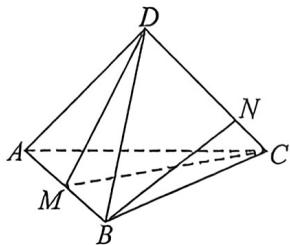

<!-- question-source:start -->
例33 (2025·多选·湖北期末)如图,四面体ABCD中,M是棱AB上的动点,N是棱CD上的动点(M、N不与四面体的顶点重合).记BN与DM所成的角为 $\varphi$ ,BN与平面MCD的所成的角为 $\theta$ ,平面MCD与平面BCD的夹角为 $\beta$ ,则 $\varphi,\theta,\beta$ 的大小关系不可能是()

(注:平面 $\alpha$ 与平面 $\beta$ 相交形成的四个二面角中, 不大于 $90^{\circ}$ 的二面角称为平面 $\alpha$ 与平面 $\beta$ 的夹角)
A. $\varphi > \theta > \beta$ B. $\varphi > \beta > \theta$ C. $\beta > \theta > \varphi$ D. $\beta > \varphi > \theta$
<!-- question-source:end -->

![[高中/总复习/二轮/2026版高中《MST新思路思维拓展》二轮复习专题/上册/立体几何/考点四_最大角最小角定理/questions/answers/Q00093313A1.md]]
