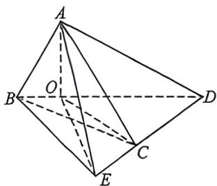

> [!faq]- 例题解析
>
> > [!success]- **【答案】** ABC
>
> > [!note]- **【解析】**
> > 解析 由题设 $\triangle ACD$ 中 $AD = \sqrt{AC^2 + CD^2 - 2AC \cdot CD\cos 120^\circ} = \sqrt{1 + 1 - 2 \times 1 \times 1 \times \left(-\frac{1}{2}\right)} = \sqrt{3}$ ,
> >
> > 在 $\triangle ACB$ 中 $AB=\sqrt{AC^{2}+BC^{2}-2AC\cdot BC\cos45^{\circ}}=1$ ，则 $\sqrt{3}AB=AD$ ，A对；
> >
> > 过A作AO⊥平面BCD于点O(注意其位置不定)，设AO=h，则 $\angle ACO=\alpha$ 为直线AC与平面BCD所成角，故 $\sin\alpha=\frac{h}{AC}=h$ ，过O作OE⊥CD于点E，由AO⊥平面BCD，DE⊂平面BCD，则 $AO\perp DE,AO\cap OE=O$ 且都在平面AOE内，则 $DE\perp$ 平面AOE,AE⊂平面AOE，则 $DE\perp AE$ ，综上， $\angle AEO=\beta$ 为二面角A-CD-B的平面角，在Rt△AOE中 $\sin\beta=\frac{h}{AE}=\frac{h}{AC\sin60^{\circ}}=\frac{2h}{\sqrt{3}}$ ，故 $\sin\alpha=\frac{\sqrt{3}}{2}\sin\beta,B$ 对；
> >
> > 由 $\angle ACB = 45^{\circ}$ ，其中 $\angle ACO$ 为 $AC$ 与平面BCD所成角，结合线面角的定义及最小角定理有 $\alpha \leqslant \angle ACB$ ，即 $0 < \alpha \leqslant 45^{\circ}$ ，D错；由 $\sin \beta = \frac{2}{\sqrt{3}}\sin \alpha$ 且 $0 < \alpha \leqslant 45^{\circ}$ ，则 $0 < \sin \alpha \leqslant \frac{\sqrt{2}}{2}$ 所以 $\cos^2\beta = 1 - \sin^2\beta = 1 - \frac{4}{3}\sin^2\alpha \geqslant 1-$ $\frac{4}{3}\times \frac{1}{2} = \frac{1}{3}$ ，即 $\cos \beta \geqslant \frac{\sqrt{3}}{3},C$ 对.故选：ABC.
> >
> > 
