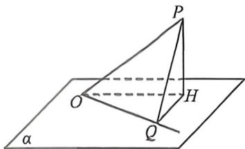
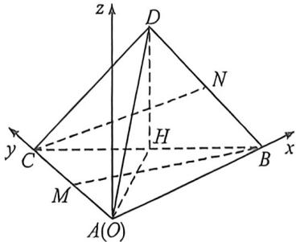
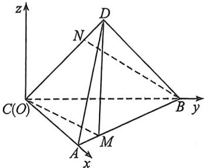

> [!faq]- 例题解析
>
> > [!success]- **【答案】** AC
>
> > [!note]- **【解析】**
> > 解析 (1)证明：(最小角定理)线面角是平面内的一条斜线与该平面内的直线所成角中的最小角.
> >
> > 如图， $OP$ 是平面 $\alpha$ 的一条斜线，点 $P$ 在平面 $\alpha$ 内的射影为 $H$ ，直线 $OQ$ 是平面 $\alpha$ 过点 $O$ 除 $OH$ 外的任意一条直线，
> >
> > 
> >
> > 下面先证明 $\cos\angle QOH\cdot\cos\angle POH=\cos\angle POQ.$ 过 H 作 $HQ\perp OQ,$ 垂足为 Q, 由 $PH\perp$ 平面 a, $OQ\subset$ 平面 a,
> > 则 $PH\perp OQ,$ 又 $HQ\cap PH=H,$ 且 HQ, $PH\subset$ 平面 HQP, 故 $OQ\perp$ 平面 HQP, $PQ\subset$ 平面 HQP, 则 $OQ\perp PQ,$ 故 $\triangle PHO, \triangle OQH, \triangle PQO$ 都是直角三角形，则 $\cos\angle QOH\cdot\cos\angle POH=\frac{OQ}{OH}\cdot\frac{OH}{OP}=\frac{OQ}{OP}=\cos\angle POQ,$ 从而 $\cos\angle POQ\leqslant\cos\angle POH,$ 又 $\angle POH, \angle POQ\in(0,\frac{\pi}{2}]$ ，故 $\angle POQ\geqslant\angle POH,$ 而 $\angle POH$ 即为 OP 与平面 a 所成的角。又由直线所成角定义可知，直线经过平移后不改变所成角，故最小角定理得证。
> > 由最小角定理，本题中可得 $\theta\leqslant\varphi$ ，故 C 大小关系不可能成立；
> > - **②**：证明：(最大角定理)两平面的夹角是平面内的直线与另一个平面所成角的最大角。如图，l 为锐二面角 $\alpha-l-\beta$ 的棱，O 为棱 l 上一点， $PH\perp\beta,$ 且 $l\perp OP, l\perp OH, Q$ 是 l 上异于点 O 的任一点。
> > 下面先证明 $\sin\angle PQO\cdot\sin\angle POH=\sin\angle PQH.$ 由题意可知， $\angle POH$ 是锐二面角 $\alpha-l-\beta$ 的平面角，即平面 $\alpha,\beta$ 的夹角。由 $PH\perp\beta,QH,OH\subset\beta,$ 则 $PH\perp QH,PH\perp OH,$ 则 $\triangle PHO,\triangle PHQ,\triangle POQ$ 都是直角三角形，
> > 则 $\sin\angle PQO\cdot\sin\angle POH=\frac{PO}{PQ}\cdot\frac{PH}{PO}=\frac{PH}{PQ}=\sin\angle PQH.$ 从而 $\sin\angle PQH\leqslant\sin\angle POH,$ 由题意又 $\angle POH,\angle PQH$ $\in(0,\frac{\pi}{2}]$ ，则 $\angle POH\geqslant\angle PQH,$ 即最大角定理得证。由最大角定理，在本题中可得 $\beta\geqslant\theta,$ 故 A 大小关系不可能成立；B 项，举例如下：如图，在四面体 ABCDABCD 中， $\triangle ABC$ 及 $\triangle DBC$ 都是等腰直角三角形，且平面 ABC⊥平面 DBC，其中 DC=DB=AC=AB=1,M 是棱 AB 上的中点，N 是棱 CD 上的中点 (M,N 不与四面体的顶点重合)、如图，取 BC 中点 H，由 DB=DC 可得 DH⊥BC，且 AH⊥BC。
> >
> > 
> >
> > 平面 $ABC \perp$ 平面 $DBC$ , 又平面 $ABC \cap$ 平面 $DBC = BC, DH \subset$ 平面 $DBC$ , 则 $DH \perp$ 平面 $ABC$ , 同理, $AH \perp$ 平面 $DBC$ . 由 $DC = DB = AC = AB = 1$ 得 $AH = DH = \frac{\sqrt{2}}{2}$ , 以 $A$ 为坐标原点, 分别以 $AB, AC$ 所在直线为 $x, y$ 轴, 建立如图所示的空间直角坐标系, 则 $A(0,0,0), B(1,0,0), C(0,1,0), D\left(\frac{1}{2}, \frac{1}{2}, \frac{\sqrt{2}}{2}\right)$ , 由此可得 $M\left(\frac{1}{2}, 0, 0\right), N\left(\frac{1}{4}, \frac{3}{4}, \frac{\sqrt{2}}{4}\right), \overrightarrow{BN} = \left(-\frac{3}{4}, \frac{3}{4}, \frac{\sqrt{2}}{4}\right), \overrightarrow{DM} = \left(0, -\frac{1}{2}, -\frac{\sqrt{2}}{2}\right)$ , 则 $\cos \varphi = |\cos \langle \overrightarrow{BN}, \overrightarrow{DM} \rangle| = \frac{\overrightarrow{BN} \cdot \overrightarrow{DM}}{|\overrightarrow{BN}| |\overrightarrow{DM}|} = \frac{\frac{5}{8}}{\frac{\sqrt{5}}{2} \times \frac{\sqrt{3}}{2}} = \frac{\sqrt{15}}{6} = \frac{3\sqrt{5}}{6\sqrt{3}}$ ; 设平
> >
> >
> > 面 MCD 的一个法向量 $n_{1}=(x,y,x)$ ,
> >
> > 则 $\left\{ \begin{array}{l} n_{1} \cdot \overrightarrow{MC} = \left(-\frac{1}{2}, 1, 0\right) \cdot (x, y, x) = -\frac{1}{2} x + y = 0 \\ \quad , \text{令 } x = 4, \text{ 则 } y = 2, z = -\sqrt{2}, \text{ 取 } n_{1} = (4, 2, -\sqrt{2}), \\ \quad \cdot \overrightarrow{CD} = \left(\frac{1}{2}, -\frac{1}{2}, \frac{\sqrt{2}}{2}\right) \cdot (x, y, x) = \frac{1}{2} x - \frac{1}{2} y + \frac{\sqrt{2}}{2} z = 0 \end{array} \right.$
> >
> > 则 $\sin \theta = |\cos \langle \overrightarrow{BN}, n_1\rangle| = \frac{|\overrightarrow{BN} \cdot n_1|}{|\overrightarrow{BN}| |n_1|} = \frac{2}{\frac{\sqrt{5}}{2} \times \sqrt{22}} = \frac{2\sqrt{2}}{\sqrt{55}}$ ，则 $\cos \theta = \frac{\sqrt{47}}{\sqrt{55}}$ ，取平面 $BCD$ 的一个法向量 $n_2 = (1, 1, 0)$ ，则 $\cos \beta = |\cos \langle n_1, n_2\rangle| = \frac{|n_1 \cdot n_2|}{|n_1||n_2|} = \frac{6}{\sqrt{22} \times \sqrt{2}} = \frac{3}{\sqrt{11}} = \frac{3\sqrt{5}}{\sqrt{55}}$ ，由 $\frac{\sqrt{47}}{\sqrt{55}} > \frac{3\sqrt{5}}{\sqrt{55}} > \frac{3\sqrt{5}}{6\sqrt{3}}$ ，即 $\cos \theta > \cos \beta > \cos \varphi$ ，则 $\theta < \beta < \varphi$ ；故 $B$ 项大小关系可能成立；
> >
> > D 项, 举例如下: 如图, 在四面体 ABCD 中, $\triangle ABC$ 与 $\triangle DBC$ 都是等腰直角三角形, 且平面 ABC⊥平面 DBC, 其中 DC=DB, CA=CB=1, M 是棱 AB 上靠近 A 的五等分点 (AM:MB=1:4),
> >
> > N 是棱 CD 上的靠近 D 的四等分点 (DN: NC=1:3), (M, N 不与四面体的顶点重合).
> >
> > 
> >
> > 由题意可知 $AC \perp BC$ , 又平面 $ABC \perp$ 平面 $DBC$ , 且平面 $ABC \cap$ 平面 $DBC = BC$ , $AC \subset$ 平面 $ABC$ ,
> >
> > 则 $AC \perp$ 平面 $DBC$ . 以 $C$ 为坐标原点, 分别以 $CA, CB$ 所在直线为 $x, y$ 轴, 建立如图所示的空间直角坐标系,
> >
> > 则 $C(0,0,0), A(1,0,0), B(0,1,0), D\left(0, \frac{1}{2}, \frac{1}{2}\right)$ ，由此可得 $M\left(\frac{4}{5}, \frac{1}{5}, 0\right), N\left(0, \frac{1}{8}, \frac{1}{8}\right), \overrightarrow{BN} = \left(0, -\frac{7}{8}, \frac{1}{8}\right), \overrightarrow{DM} = \left(\frac{4}{5}, -\frac{3}{10}, -\frac{1}{2}\right)$ ，则 $\cos \varphi = |\cos \langle \overrightarrow{BN}, \overrightarrow{DM} \rangle| = \frac{\overrightarrow{BN} \cdot \overrightarrow{DM}}{|\overrightarrow{BN}| |\overrightarrow{DM}|} = \frac{\frac{1}{5}}{\frac{\sqrt{50}}{8} \times \frac{7\sqrt{2}}{10}} = \frac{8}{35}$ ；设平面 $MCD$ 的一个法向量 $n_1 = (x, y, z)$ ，则 $\begin{cases} n_1 \cdot \overrightarrow{MC} = \left(-\frac{4}{5}, -\frac{1}{5}, 0\right) \cdot (x, y, z) = -\frac{4}{5}x - \frac{1}{5}y = 0 \\ n_1 \cdot \overrightarrow{CD} = \left(0, \frac{1}{2}, \frac{1}{2}\right) \cdot (x, y, z) = \frac{1}{2}y + \frac{1}{2}z = 0 \end{cases}$ ，令 $x = 1$ ，则 $y = -4, z = 4$ ，取 $n_1 = (1, -4, 4)$ ，则 $\sin \theta = |\cos (\overrightarrow{BN}, n_1)| = \frac{|\overrightarrow{BN} \cdot n_1|}{|\overrightarrow{BN}| |n_1|} = \frac{4}{\frac{\sqrt{50}}{8} \times \sqrt{33}} = \frac{32}{5\sqrt{66}}$ ，则 $\cos \theta = \frac{\sqrt{626}}{5\sqrt{66}}$ ，取平面 $BCD$ 的一个法向量 $n_2 = (1, 0, 0)$ ，则 $\cos \beta = |\cos \langle n_1, n_2\rangle| = \frac{|n_1 \cdot n_2|}{|n_1||n_2|} = \frac{1}{\sqrt{33}}$ ，由 $\frac{626}{5\sqrt{66}} > \frac{8}{35} > \frac{1}{\sqrt{33}}$ ，即 $\cos \theta > \cos \varphi > \cos \beta$ ，则 $\theta < \varphi < \beta$ ；故 $D$ 项大小关系可能成立；综上，大小关系不成立的是 $AC$ 。
> >
> > 故选 **AC**。
