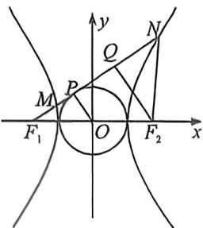
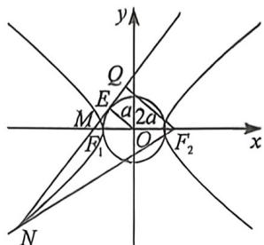

<!-- question-source:start -->
例3 (2022·乙卷)双曲线 C 的两个焦点为 $F_{1}, F_{2}$ ，以 C 的实轴为直径的圆记为 D，过 $F_{1}$ 作 D 的切线与 C 交于 M, N 两点，且 $\cos\angle F_{1}NF_{2}=\frac{3}{5}$ ，则 C 的离心率为（）

A. $\frac{\sqrt{5}}{2}$ B. $\frac{3}{2}$ C. $\frac{\sqrt{13}}{2}$ D. $\frac{\sqrt{17}}{2}$

<!-- question-source:end -->

![[高中/总复习/二轮/2026版高中《MST新思路思维拓展》二轮复习专题/下册/板块1_不等式/考点一_圆锥曲线之间交点/questions/answers/Q00093357A1.md]]
