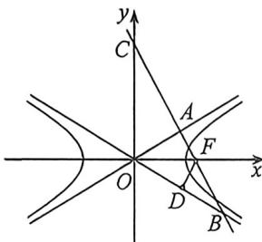

<!-- question-source:start -->
例4 (2026 届南昌 9 月开学考·T13) 如图, 双曲线 $C: \frac{x^{2}}{a^{2}} - \frac{y^{2}}{b^{2}} = 1$ 的右焦点为 $F$ , 过点 $F$ 作渐近线 $l_{1}: y = \frac{b}{a} x$ 的垂线 $l$ , 垂足为 $A$ , 且 $l$ 与另一条渐近线、 $y$ 轴分别交于 $B, C$ , 若 $\overrightarrow{BA} = \overrightarrow{AC}$ , 则双曲线的离心率为 \_\_\_\_.

<!-- question-source:end -->

![[高中/总复习/二轮/2026版高中《MST新思路思维拓展》二轮复习专题/下册/板块1_不等式/考点一_圆锥曲线之间交点/questions/answers/Q00093358A1.md]]
