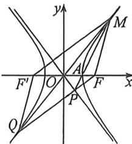

<!-- question-source:start -->
例5 (2026 届重庆巴蜀开学·T8)已知双曲线 $E: \frac{x^{2}}{a^{2}} - \frac{y^{2}}{b^{2}} = 1 (a > 0, b > 0)$ 的右焦点为 $F$ , 右顶点为 $A$ , 过点 $F$ 的直线与双曲线 $E$ 的一条渐近线交于点 $P$ , 与其左支交于点 $Q$ , 且点 $P$ 与点 $Q$ 不在同一象限, 直线 $AP$ 与直线 $OQ$ ( $O$ 为坐标原点)的交点在双曲线 $E$ 上, 若 $\overrightarrow{PQ} = -3 \overrightarrow{PF}$ , 则双曲线 $E$ 的离心率为

A. $\frac{7}{3}$ B. $\frac{5}{3}$ C. 2

D. 3

<!-- question-source:end -->

![[高中/总复习/二轮/2026版高中《MST新思路思维拓展》二轮复习专题/下册/板块1_不等式/考点一_圆锥曲线之间交点/questions/answers/Q00093359A1.md]]
