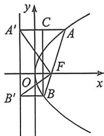
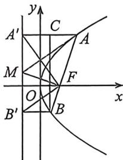

<!-- question-source:start -->
例9 (2026届襄阳四中高三测试·T10)已知抛物线 $C: y^{2} = 2px (p > 0)$ , 准线为 $l$ , 过焦点 $F$ 的直线交抛物线 $C$ 于 $A, B$ 两点, 过 $A, B$ 分别作 $l$ 的垂线, 垂足分别为 $A', B'$ , 则 ( )
A. $FA' \perp FB'$ B. 若 $|AF| = 3 |BF|$ , 则直线 $AB$ 的斜率为 $\sqrt{3}$ C. $A, O, B'$ 三点共线 (其中 $O$ 为坐标原点)
D. $|A'B'|^{2} = 4 |AF||BF|$

<!-- question-source:end -->

![[高中/总复习/二轮/2026版高中《MST新思路思维拓展》二轮复习专题/下册/板块1_不等式/考点一_圆锥曲线之间交点/questions/answers/Q00093362A1.md]]
