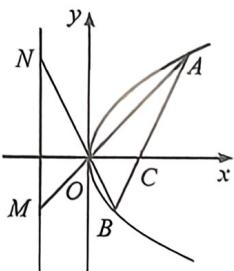
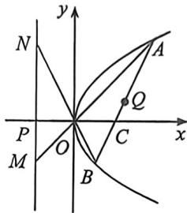

<!-- question-source:start -->
例10 (湖北部分学校 2026 届高三九月测试 · T11) 如图, 过点 $C(a,0)(a>0)$ 的直线 $AB$ 交抛物线 $y^{2}=2px\quad(p>0)$ 于 $A,B$ 两点, 连接 $AO、BO$ , 并延长, 分别交直线 $x=-a$ 于 $M,N$ 两点, 则下列结论中一定成立的有

A. $BM \parallel AN$ B. 以 $AB$ 为直径的圆与直线 $x = -a$ 相切 C. $S_{\triangle AOB} = S_{\triangle MDN}$ D. $S_{\triangle MCN}^2 = 4S_{\triangle ANC} \cdot S_{\triangle BCM}$
<!-- question-source:end -->

![[高中/总复习/二轮/2026版高中《MST新思路思维拓展》二轮复习专题/下册/板块1_不等式/考点一_圆锥曲线之间交点/questions/answers/Q00093363A1.md]]
