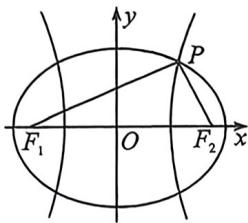

<!-- question-source:start -->
例17（福建厦门外国语学校2026届高三9月月考·T14）已知椭圆 $C_1: \frac{x^2}{a_1^2} + \frac{y^2}{b_1^2} = 1 (a_1 > b_1 > 0)$ 与双曲线 $C_2: \frac{x^2}{a_2^2} - \frac{y^2}{b_2^2} = 1 (a_2 > 0, b_2 > 0)$ 有相同的焦点 $F_1, F_2$ ，若点 $P$ 是 $C_1$ 与 $C_2$ 在第一象限内的交点，且 $|F_1 F_2| = 2 |PF_2|$ ，设 $C_1$ 与 $C_2$ 的离心率分别为 $e_1, e_2$ ，则 $e_2 - e_1$ 的取值范围是 \_\_\_\_.

<!-- question-source:end -->

![[高中/总复习/二轮/2026版高中《MST新思路思维拓展》二轮复习专题/下册/板块1_不等式/考点一_圆锥曲线之间交点/questions/answers/Q00093370A1.md]]
