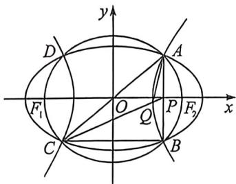

<!-- question-source:start -->
例18 (2025·江西南昌模拟·T8)如图,已知椭圆 $C_1$ 和双曲线 $C_2$ 具有相同的焦点 $F_1(-c,0), F_2(c,0)$ , $A, B, C, D$ 是它们的公共点,且都在圆 $x^2 + y^2 = c^2$ 上,直线 $AB$ 与 $x$ 轴交于点 $P$ ,直线 $CP$ 与双曲线 $C_2$ 交于点 $Q$ ,记直线 $AC, AQ$ 的斜率分别为 $k_1, k_2$ ,若椭圆 $C_1$ 的离心率为 $\frac{2\sqrt{5}}{5}$ ,则 $k_1 \cdot k_2$ 的值为

<!-- question-source:end -->

![[高中/总复习/二轮/2026版高中《MST新思路思维拓展》二轮复习专题/下册/板块1_不等式/考点一_圆锥曲线之间交点/questions/answers/Q00093566A1.md]]
