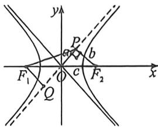

> [!faq]- 例题解析
>
> > [!success]- **【答案】** C
>
> > [!note]- **【解析】**
> > 解析式曲线 $\frac{x^2}{a} -\frac{y^2}{b} = 1(a > 0,b > 0)$ 的一条渐近线方程为 $y = \frac{b}{a} x$ ，所以点 $F_{2}$ 到渐近线的距离 $|PF_2| = b$ ，所以 $|OP$ $| = a,\cos \angle PF_3O = \frac{b}{c}$ ，因为 $|PF_1| = \sqrt{6}|OP|$ ，所以 $|PF_1| = \sqrt{6} a,$
> >
> > 法一(余弦定理)在三角形 $F_{1}PF_{3}$ 中，由余弦定理得 $\left|PF_{1}\right|^{2}=\left|PF_{2}\right|^{2}+\left|F_{1}F_{2}\right|^{2}-2\left|PF_{2}\right|\cdot\left|F_{1}F_{2}\right|\cos\angle PF_{2}O,$
> >
> >
> > 所以 $6a^{2} = b^{2} + 4c^{2} - 2 \times b \times 2c \times \frac{b}{c} = 4c^{2} - 3(c^{2} - a^{2})$ ，即 $3a^{2} = c^{2}$ ，即 $\sqrt{3}a = c$ ，所以 $e = \frac{c}{a} = \sqrt{3}$ ，故选：C. 法二（极化恒等式）由 $OP$ 为 $\triangle F_{1}PF_{2}$ 的中线，故 $\frac{1}{2} (|PF_{1}|^{2} + |PF_{2}|^{2}) = |OP|^{2} + |OF_{2}|^{2} \Rightarrow 6a^{2} + b^{2} = 2a^{2} + 2c^{2}$ ，即 $3a^{2} = c^{2}$ ，即 $\sqrt{3}a = c$ ，所以 $e = \frac{c}{a} = \sqrt{3}$ ，
> >
> > 
> >
> > 法三:(对称化构造),如图,过 $F_{1}$ 作 $F_{1}Q\perp OP$ 交其延长线于Q,所以 $|F_{1}Q|=b,|PQ|=2a$ ,所以 $|PF_{1}|^{2}-|PQ|^{2}=|F_{1}Q|^{2}$ ,即 $b^{2}=2a^{2}$ ,所以 $e=\frac{c}{a}=\sqrt{3}$ ,
> >
> > 故选 **C**.
