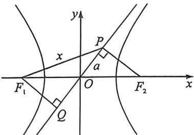

> [!faq]- 例题解析
>
> > [!success]- **【答案】** D
>
> > [!note]- **【解析】**
> > 解析 法一:(坐标语言)因为过 $F_{2}(c,0)$ 作一条渐近线 $y=\frac{b}{a}x$ 的垂线,垂足为 $P$ ,则 $|PF_{2}|=b=2$ ,
> >
> > 联立 $\left\{\begin{aligned}y&=\frac{b}{a}x\\ y&=-\frac{a}{b}(x-c)\end{aligned}\right.$ ，可得 $x=\frac{a^{2}}{c},y=\frac{ab}{c}$ ，即 $P\left(\frac{a^{2}}{c},\frac{ab}{c}\right)$ ，因为直线 $PF_{1}$ 的斜率 $\frac{\frac{ab}{c}}{\frac{a^{2}}{c}+c}=\frac{\sqrt{2}}{4}$
> >
> > 整理得 $\sqrt{2}(a^2 + c^2) = 4ab$ ②，①②联立得， $a = \sqrt{2}, b = 2$ ，故双曲线方程为 $\frac{x^2}{2} - \frac{y^2}{4} = 1$ .
> >
> > 
> >
> > 法二:(对称化构造)如图,过 $F_{1}$ 作 $F_{1}Q\perp OP$ 交其延长线于Q,所以 $|PF_{2}|=|F_{1}Q|=b=2,|PQ|=2a$ ,由于直线 $PF_{1}$ 的斜率为 $\frac{\sqrt{2}}{4}$ ,则 $\tan\alpha=\frac{\sqrt{2}}{4}$ ,令 $\angle OF_{1}Q=\beta,\tan\beta=\frac{a}{2}$ ,且 $\tan(\alpha+\beta)=\frac{2a}{2}=a=\frac{\tan\alpha+\tan\beta}{1-\tan\alpha\tan\beta}$ ,所以 $a=\frac{\frac{\sqrt{2}}{4}+\frac{a}{2}}{1-\frac{\sqrt{2}a}{8}}$ , $a=\sqrt{2}$ ,
> >
> > 故选 **D**.
