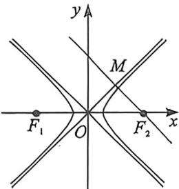
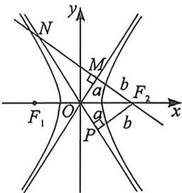
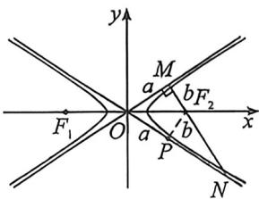

> [!faq]- 例题解析
>
> > [!success]- **【答案】** AC
>
> > [!note]- **【解析】**
> > 解析 设 $x$ 曲线的方程为 $\frac{x^2}{a^2} -\frac{y^2}{b^2} = 1(a > 0,b > 0)$ ，设过 $F_{1}$ 的切线与圆 $D:x^{2} + y^{2} = a^{2}$ 相切于点 $P$
> >
> > 过 $F_{2}$ 作 $F_{2}Q \perp F_{1}N$ 于点 $Q$ , 由 $\cos \angle F_{1}NF_{2} = \frac{3}{5}$ , 设 $|NQ| = 3x$ , $|F_{2}Q| = 4x$ , $|F_{2}N| = 5x$ ,
> >
> > 设 $MN$ 切圆 $O$ 于点 $P$ , 则 $|OP|=a$ , $|OP|=\frac{1}{2}|QF_2|=2x$ (中位线), $a=2x$ , $|F_1N|-|F_2N|=2a=4x$ , $|F_1N|=|$ $F_2N|+2a=|F_2N|+4x=9x$ , $|F_1Q|=|F_1N|-|NQ|=9x-3x=6x$ , $|F_1P|=\frac{1}{2}|F_1Q|=3x$ ,
> >
> > $|F_{1}O| = \sqrt{|F_{1}P|^{2} + |OP|^{2}} = \sqrt{13} x, |F_{1}O| = \sqrt{13} x, e = \frac{c}{a} = \frac{|F_{1}O|}{|OP|} = \frac{\sqrt{13}}{2}$ , 选项 C 正确
> >
> > 若 M, N 在双曲线同一支，如图所示过 $F_{2}$ 作 $F_{2}Q \perp MN$ 于点 Q, OE = a, $F_{2}Q = 2a$ , $F_{1}Q = 2b$ ，因为 $\cos\angle F_{1}NF_{2} = \frac{3}{5}$ ，
> > 所以 $NQ=\frac{3}{2}a, NF_{2}=\frac{5}{2}a, F_{1}N=\frac{3}{2}a-2b, \frac{5}{2}a-\frac{3}{2}a+2b=2a\Rightarrow2b=a, \frac{b}{a}=\frac{1}{2}, \frac{c}{a}=\frac{\sqrt{5}}{2}$ ，故选项 A 正确，故选：AC.
> >
> > 2. 焦点到渐近线距离隐藏的相似三角形构造
> >
> > 
> >
> > 
> >
> > 
> > - **①**：如左图所示,当离心率 $e=\sqrt{2}$ 时,过焦点作渐近线垂线,则不会形成直角三角形;
> > - **②**：如右图所示,当离心率 $e>\sqrt{2}$ 时,过焦点 $F_{2}$ 作渐近线 $l_{1}$ 垂线 $MN(k_{MN}<0)$ ,会交 $l_{2}$ 于第二象限点N,令 $\overrightarrow{NM}=\lambda\overrightarrow{MF_{2}}$ ,则双曲线离心率为 $e=\sqrt{2}\cdot\sqrt{\frac{\lambda+1}{\lambda}}$ ;
> >
> > 证明:作 $F_{2}P \perp l_{2}$ 于 P, 易知 $|OM| = |OP| = a, |F_{2}M| = |F_{2}P| = b, \triangle OMN \sim \triangle F_{2}PN$ , 则 $\frac{|ON|}{|F_{2}N|} = \frac{|OM|}{|F_{2}P|}$ , 可知: $|ON| = (1 + \lambda)a$ , 根据勾股定理 $|OM|^{2} + |MN|^{2} = |ON|^{2}$ , 即 $\frac{b^{2}}{a^{2}} = \frac{\lambda + 2}{\lambda}$ , 故 $e^{2} = 1 + \frac{b^{2}}{a^{2}} = \frac{2\lambda + 2}{\lambda}$ , 所以 $e = \sqrt{2} \cdot \sqrt{\frac{\lambda + 1}{\lambda}}$ .
> > - **③**：如图所示,当离心率 $e < \sqrt{2}$ 时,过焦点 $F_{2}$ 作渐近线 $l_{1}$ 垂线 $MN(k_{MN} < 0)$ ,会交 $l_{2}$ 于第四象限点 $N$ ,令
> >
> >
> > $\overrightarrow{NF_{1}}=\lambda\overrightarrow{F_{2}M}$ ，则双曲线离心率为 $e=\sqrt{2}\cdot\sqrt{\frac{\lambda}{\lambda+1}}$ ;
> >
> > 证明:作 $F_{2}P \perp l_{2}$ 于 P, 易知 $|OM| = |OP| = a, |F_{2}M| = |F_{2}P| = b, \triangle OMN \sim \triangle F_{2}PN$ , 则 $\frac{|ON|}{|F_{2}N|} = \frac{|OM|}{|F_{2}P|}$ , 可知: $|ON| = \lambda a$ , 根据勾股定理 $|OM|^{2} + |MN|^{2} = |ON|^{2}$ , 即 $\frac{b^{2}}{a^{2}} = \frac{\lambda - 1}{\lambda + 1}$ , 故 $e^{2} = 1 + \frac{b^{2}}{a^{2}} = \frac{2\lambda}{\lambda + 1}$ , 所以 $e = \sqrt{2} \cdot \sqrt{\frac{\lambda}{\lambda + 1}}$ .
> >
> > 总结:一切源于直角三角形相似,需要作辅助线构造,其实结论很好理解记忆,就是e与 $\sqrt{2}$ 比大小,大于 $\sqrt{2}$ 就是 $e=\sqrt{2}\sqrt{\frac{\lambda+1}{\lambda}}$ ,小于 $\sqrt{2}$ 就是 $e=\sqrt{2}\cdot\sqrt{\frac{\lambda}{\lambda+1}}$ .
