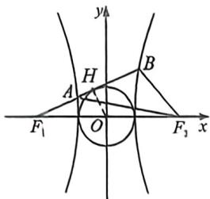
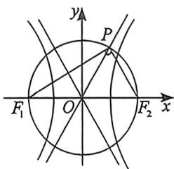
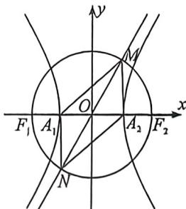

> [!faq]- 例题解析
>
> > [!success]- **【答案】** ACD
>
> > [!note]- **【解析】**
> > 解析 法一:作出示意图如图所示:根据双曲线的定义得 $\left|AF_{1}\right|=\left|BF_{1}\right|-\left|BF_{2}\right|=2a,\left|AF_{2}\right|=\left|AF_{1}\right|+2a=4a$ ，在三角形 $AF_{1}F_{2}$ 中，由余弦定理可得 $\cos\angle AF_{1}F_{2}=\frac{\left|AF_{1}\right|^{2}+\left|F_{1}F_{2}\right|^{2}-\left|AF_{2}\right|^{2}}{2\left|AF_{1}\right|\times\left|F_{1}F_{2}\right|}=\frac{4a^{2}+4c^{2}-16a^{2}}{2\times2a\times2c}=\frac{b^{2}-2a^{2}}{2ac}$ ，作 $OH\perp AB$ 于 H，又直线 $AF_{1}$ 与圆 $x^{2}+y^{2}=a^{2}$ 相切，所以 $\cos\angle AF_{1}F_{2}=\frac{\left|F_{1}H\right|}{\left|OF_{1}\right|}=\frac{b}{c}$ ，所以 $\frac{b^{2}-2a^{2}}{2ac}=\frac{b}{c}$
> >
> >
> > 
> >
> > 解得 $b^{2} - 2ab - 2a^{2} = 0$ ，所以 $\left(\frac{b}{a}\right)^2 - 2 \times \frac{b}{a} - 2 = 0$ ，解得 $\frac{b}{a} = 1 + \sqrt{3}$ 或 $\frac{b}{a} = 1 - \sqrt{3}$ （舍去），
> >
> > 法二： $\left|AF_{1}\right|=\left|BF_{1}\right|-\left|BF_{2}\right|=2a$ ，且 $\cos\angle AF_{1}F_{2}=\frac{\left|F_{1}H\right|}{\left|OF_{1}\right|}=\frac{b}{c}$ ，故 $\left|AF_{1}\right|=\frac{b^{2}}{a+c\cos\alpha}=\frac{b^{2}}{a+b}=2a$ ，所以 $b^{2}-2ab-2a^{2}=0,\frac{b}{a}=1+\sqrt{3}$ ，故答案为： $y=\pm(1+\sqrt{3})x.$
> >
> > 4. 大圆与渐近线交点构造坐标特征三角形
> >
> > 这里通常是双曲线的坐标特征三角形,需要借助辅助大圆.
> >
> > 如图, 以 $F_{1} F_{2}$ 为直径的圆与双曲线 $\frac{x^{2}}{a^{2}} - \frac{y^{2}}{b^{2}} = 1 (a > 0, b > 0)$ 的渐近线在第一象限内的交点坐标为 $P(a, b)$ . 不过, 很多时候, 题目会以“点 $P$ 在渐近线上, 且 $PF_{1} \perp PF_{2}$ ”的形式给出条件.
> >
> > 
> >
> > 证明:渐近线的方程为 $y=\frac{b}{a}x$ ，设 $P(am,bm)(m>0)$ ，则 $OP^{2}=a^{2}m^{2}+b^{2}m^{2}=c^{2}$ ，即 m=1，即 $P(a,b)$ 例7 (2025 新课标Ⅱ卷·T11)对于双曲线 $C:\frac{x^{2}}{a^{2}}-\frac{y^{2}}{b^{2}}=1(a>0,b>0)$ ，左、右焦点为 $F_{1}$ 、 $F_{2}$ ，左、右顶点为 $A_{1}$ 、 $A_{2}$ ，以 $F_{1}F_{2}$ 为直径的圆与 C 的一条渐近线交于 M、N，且 $\angle NA_{1}M=\frac{5\pi}{6}$ ，下列说法正确的是
> > () A. $\angle A_{1}MA_{2}=\frac{\pi}{6}$ B. $|MA_{1}|=2|MA_{2}|$ C. C 的离心率为 $\sqrt{13}$ D. 当 $a=\sqrt{2}$ 时，四边形 $NA_{1}MA_{2}$ 的面积为 $8\sqrt{3}$
> >
> > 解析 设斜率为正的渐近线 $l_{MN}: y = \frac{b}{a} x$ ，又 $MO = r = c$ ，则 $M(a, b)$ ，又 $A_1(-a, 0), A_2(a, 0)$ ，则 $MA_2 \perp A_1A_2$ ，如图：
> >
> > 
> >
> > $\angle A_{1}MA_{2}=\pi-\angle NA_{1}M=\frac{\pi}{6},A$ 正确；
> >
> > 则在 $\mathrm{Rt}\triangle A_1MA_2$ 中， $\angle MA_{1}A_{2} = 60^{\circ}$ ，故 $\sqrt{3}|MA_1| = 2|MA_2|$ ，B错误；
> >
> > 因为 $\tan \angle A_{1}MA_{2} = \frac{2a}{b} = \frac{\sqrt{3}}{3}$ ，则 $e = \frac{c}{a} = \sqrt{1 + \frac{b^2}{a^2}} = \sqrt{13}$ ，C正确；
> >
> > 当 $a = \sqrt{2}$ 时， $S_{\mathsf{MA}_1, \mathsf{MA}_2} = 2 \times \frac{1}{2} |MA_1| \cdot |MA_2| = 2ab = 8\sqrt{3}$ ，D 正确，故本题选 ACD.
